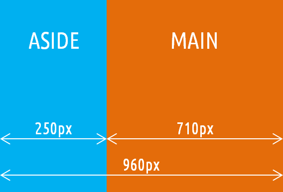
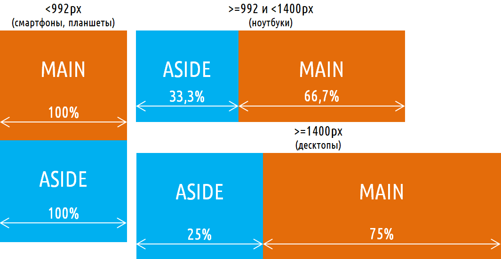
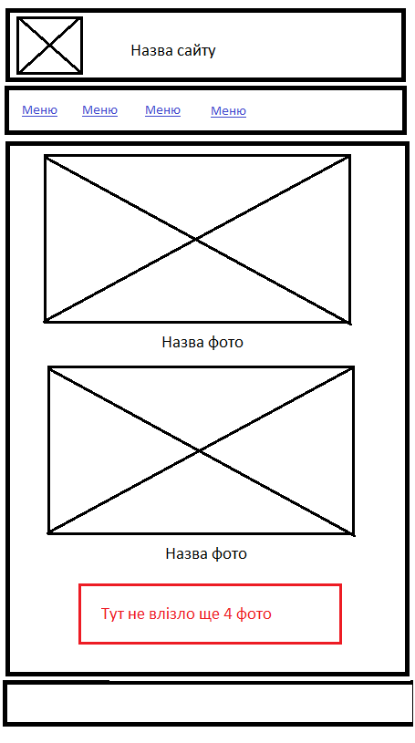

# Створення адаптивного макету методом блочного верстання

## Перелік лабораторних робіт

1.  [Створення HTML-сторінки та перевірка її валідатором w3c](lab-01.md)
2.  [Оформлення сторінки з використанням графічних та медіа елементів](lab-01.md)
3.  [Використання методу табличного верстання](lab-01.md)
4.  [Робота з формами та елементами керування. Консоль розробника](lab-01.md)
5.  [Використання методу блочного верстання для створення каркасу документу](lab-01.md)
6.  [Створення адаптивного макету методом блочного верстання](lab-01.md)
7.  [Створення меню до адаптивного макету](lab-01.md)
8.  [Створення каркасу адаптивної сторінки за допомогою фреймворку Bootstrap](lab-01.md)
9.  [Створення адаптивної фотогалереї за допомогою фреймворку Bootstrap](lab-01.md)
10. [Використання коду JavaScript на сторінці. Консоль розробника](lab-01.md)
11. [Створення інтерактивних сторінок за допомогою JavaScript](lab-01.md)
12. [Робота з елементами DOM](lab-01.md)
13. [Оптимізація коду. Використання функцій](lab-01.md)
14. [Створення об'єктів](lab-01.md)
15. [Обробка помилок обчислень](lab-01.md)
16. [Кодування та декодування нотації JSON](lab-01.md)
17. [Створення інтерактивної галереї з використання технології AJAX](lab-01.md)
18. [Використання бібліотеки jQuery для обробки подій на сторінці](lab-01.md)
19. [Використання бібліотеки jQuery для обміну данними](lab-01.md)
20. [Створення фотогалереї за допомогою jQuery та Bootstrap](lab-01.md)

## Мета роботи

Розглянути приклади створення адаптивного каркасу сторінки методом блночного верстання. Навчитись створювати адаптивні каркаси за допомогою методики блочного верстання.

## Обладнання

Персональний комп'ютер. Текстовий редактор Sublime Text 3 або Notepad++. Пакет програм XAMPP. Web-браузер Chrome, Firefox, Opera, MS Edge

## Теоретичні відомості

### 1. Відмінності фіксованого, гумового та адаптивного макетів

#### 1.1 Фіксований макет

Фіксований макет сайту - це макет, який має строго фіксовану ширину (в пікселях). Такий вид дизайну широко використовувався для розробки сайтів в минулому. У цей час "панували" комп'ютери з моніторами, що мають діагональ 15" або 17". Ці монітори не сильно відрізнялися за горизонтальною роздільною здатністю. Таким чином, вибравши для розмітки якусь певну ширину, можна розробити сайт, який оптимально б відображався на обмеженній кількості моніторів.

|  |
| :------------------------------------- |
| Рис. Фіксований макет |

HTML та CSS для такого макету може виглядати наступним чином:

```
<!DOCTYPE html>
<html lang="en">
<head>
	<title>Test page</title>
<style>
body {
  margin: 0;
}
.container {
  margin-left: auto;
  margin-right: auto;
  width: 960px;
}
.aside {
  float: left;
  width: 250px;
}
.main {
  margin-left: 250px;
}
</style>
</head>
<body>
<div class="container">
  <aside class="aside">
    ASIDE
  </aside>
  <main class="main">
    MAIN
  </main>
</div>
</body>
 ```

#### 1.2 Гумовий макет

Гумовий (гнучкий) макет сайту - це макет, який змінюється в залежності від ширини робочої області вікна (вкладки) браузера. Потреба в такій розмітці виникла, коли у користувачів з'явилися монітори, які мають діагональ від 15" до 21" і більше.

Для вирішення проблеми різної роздільної здатності моніторів змінили підходи до створення розмітки, в якій блоки мають не строго фіксовану ширину, а змінну ("гумову", зазвичай задану у відсотках). Такий макет на відміну від фіксованого вже міг «підлаштовуватися» під розміри монітора, тобто змінювати свої розміри.

<!-- |  |  |
|:-----------------------------------------------|:-----------------------------------------------|
| Рис. Гнучкий макет варіант 1 | Рис. Гнучкий макет варіант 2 |
|:------------------------------------------------------------|
| HTML та CSS для такого макету може виглядати наступним чином: | -->

|  |
|:-----------------------------------------------|
| Рис. Гнучкий макет варіант 1 |

HTML та CSS для такого макету може виглядати наступним чином:
```
<!DOCTYPE html>
<html lang="en">
<head>
	<title>Test page</title>
<style>
body {
  margin: 0;
}
.aside {
  float: left;
  width: 250px;
}
.main {
  margin-left: 250px;
}
</style>
</head>
<body>
<div class="container">
  <aside class="aside">
    ASIDE
  </aside>
  <main class="main">
    MAIN
  </main>
</div>
</body>
```
|  |
|:-----------------------------------------------|
| Рис. Гнучкий макет варіант 2 |

HTML та CSS для такого макету може виглядати наступним чином:
```
<!DOCTYPE html>
<html lang="en">
<head>
	<title>Test page</title>
<style>
body {
  margin: 0;
}
.aside {
  float: left;
  width: 25%;
}
.main {
  margin-left: 25%;
}
</style>
</head>
<body>
<div class="container">
  <aside class="aside">
    ASIDE
  </aside>
  <main class="main">
    MAIN
  </main>
</div>
</body>
```

##### 1.3 Адаптивний макет сайту

Адаптивний макет сайту - це макет, який може «пристосовуватися» під різні пристрої (ширину робочої області вікна браузера). Тобто на одних пристроях він може мати одну структуру, а на інших - іншу.

Розглянемо приклад адаптивного макета, що складається з 2 блоків, який на різних пристроях виглядає по-різному. А саме:

1. На смартфонах і планшетах (пристроях з дуже маленьким розміром екрану) блоки повинні розташовуватися вертикально, тобто один під іншим;
2. На ноутбуках (пристроях із середнім розміром екрану) блоки повинні розташовуватися горизонтально (1 блок - 33.3%, 2 блок - 66.7%);
3. На десктопах (пристроях з великим розміром екрану) теж горизонтально, але з іншими розмірами (1 блок - 25%, 2 блок - 75%)

||
|:-------------------------------------|
| Рис. Фіксований макет |

HTML та CSS для такого макету може виглядати наступним чином:

```
<!DOCTYPE html>
<html lang="en">
<head>
	<title>Test page</title>
<style>
body {
  margin: 0;
}
.container {
  display: flex;
  flex-wrap: wrap;
}
.aside, .main {
  width: 100%;
  min-height: 1px;
}
@media (min-width: 992px) {
  .aside {
    flex: 0 0 33.333333%;
    max-width: 33.333333%;
    order: 1;
  }
  .main {
    flex: 0 0 66.666667%;
    max-width: 66.666667%;
    order: 2;
  }
}
@media (min-width: 1400px) {
  .aside {
    flex: 0 0 25%;
    max-width: 25%;
  }
  .main {
    flex: 0 0 75%;
    max-width: 75%;
  }
}
</style>
</head>
<body>
<div class="container">
  <aside class="aside">
    ASIDE
  </aside>
  <main class="main">
    MAIN
  </main>
</div>
</body>
```
## Хід роботи

1. Перевірити чи встановлено пакет програм web-розробника XAMPP
2. Викликати панель керування xampp-control.exe
3. Впевнитись, що web-сервер Apache запущений
4. Перейти за адресою http://127.0.0.1/ або http://localhost/ та впевнитись, що сторінка вітання XAMPP завантажилась
5. Очистити зміст каталогу C:\xampp\htdocs\
6. Створити файл index.html в середині каталогу C:\xampp\htdocs\
7. У файл index.html помістити код, що наданий у теоретичних відомостях в розділі 1.3
8. Перейти за адресою http://127.0.0.1/ або http://localhost/ та впевнитись, що сторінка, яку ви створили, завантажилася корректно
9. Створіть сторінку фотогалереї, що відповідає прототипу, наведеному нижче.

Оформіть дизайн сторінки згідно з власним смаком. Під час створення імен классів та ідентифікаторів використовувати рекомендації БЕМ. Для виділення окремих структурних блоків сторінки використовувати семантичні елементи HTML5.

||
|:--------------------------------------------------------|
| Рис. Прототип сторінки на великий екран |

||
|:---------------------------------------------------------|
| Рис. Прототип сторінки на середній екран |

||
|:-------------------------------------------------------------|
| Рис. Прототип сторінки на мобільний пристрій |

10. Використовуючи, як приклад, попередній код, створіть триколонковий адаптивний макет, який відповідатиме прототипу** . Також необхідно створити варіанти для середнього та малого екранів.

Оформіть дизайн сторінки згідно з власним смаком. Під час створення імен классів та ідентифікаторів використовувати рекомендації БЕМ. Для виділення окремих структурних блоків сторінки використовувати семантичні елементи HTML5.

||
|:--------------------------------------------------------|
| Рис. Прототип сторінки на великий екран |

11. Зберегти файли та перевірити їх на валідність
12. HTML-код файлу галереї та скріншоти на різних екранах зберегти у звіт
13. Зберегти звіт у форматі PDF
14. Роздрукувати звіт та письмово відповісти на контрольні запитання


## Контрольні питання

1. Чим відрізняється гнучкий макет від адаптивного?
2. Для чого використовується властивість flex?
3. За допомогою чого можна створити стилі для різних розмірів екрану?
4. Яким чином вказати, що певні стилі будуть відноситись до екрану, розмір якого менше за 1024 пікселі?
5. Чим відрізняються властивості CSS width, min-width, max-width?


## Довідники та додаткові матеріали

1. [Валідатор W3C](https://validator.w3.org)
2. [Довідник HTML та CSS](https://css.in.ua)
3. [Справочник по HTML](http://htmlbook.ru)
4. [Комплексний довідник web-розробника](https://www.w3schools.com)
5. [Семантические элементы HTML5](https://html5book.ru/html5-semantic-elements)
6. [Плавающие элементы](http://htmlbook.ru/samlayout/blochnaya-verstka/plavayushchie-elementy)

---

** - завдання підвищеної складності для самостійного вивчення.
