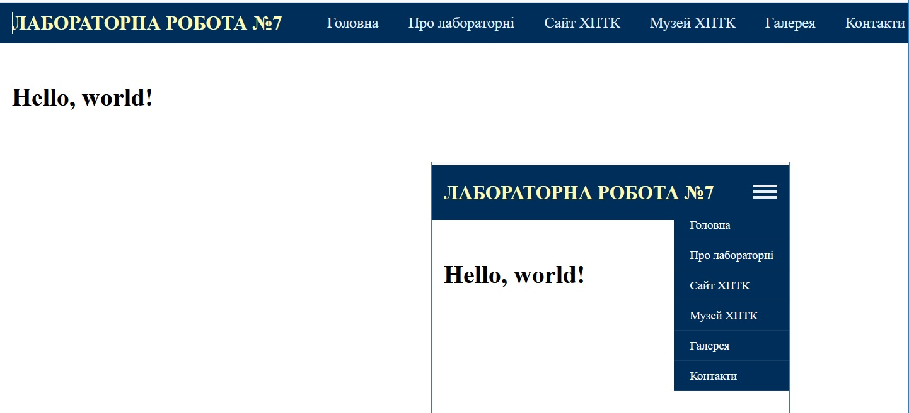
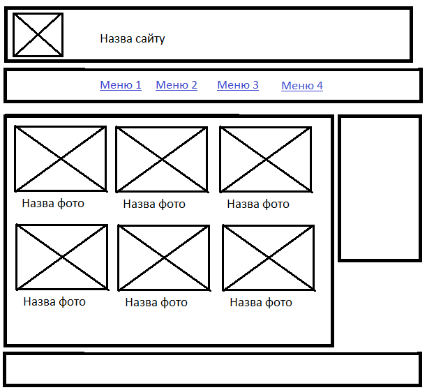

# Створення меню до адаптивного макету

## Перелік лабораторних робіт

1.  [Створення HTML-сторінки та перевірка її валідатором w3c](lab-01.md)
2.  [Оформлення сторінки з використанням графічних та медіа елементів](lab-01.md)
3.  [Використання методу табличного верстання](lab-01.md)
4.  [Робота з формами та елементами керування. Консоль розробника](lab-01.md)
5.  [Використання методу блочного верстання для створення каркасу документу](lab-01.md)
6.  [Створення адаптивного макету методом блочного верстання](lab-01.md)
7.  [Створення меню до адаптивного макету](lab-01.md)
8.  [Створення каркасу адаптивної сторінки за допомогою фреймворку Bootstrap](lab-01.md)
9.  [Створення адаптивної фотогалереї за допомогою фреймворку Bootstrap](lab-01.md)
10. [Використання коду JavaScript на сторінці. Консоль розробника](lab-01.md)
11. [Створення інтерактивних сторінок за допомогою JavaScript](lab-01.md)
12. [Робота з елементами DOM](lab-01.md)
13. [Оптимізація коду. Використання функцій](lab-01.md)
14. [Створення об'єктів](lab-01.md)
15. [Обробка помилок обчислень](lab-01.md)
16. [Кодування та декодування нотації JSON](lab-01.md)
17. [Створення інтерактивної галереї з використання технології AJAX](lab-01.md)
18. [Використання бібліотеки jQuery для обробки подій на сторінці](lab-01.md)
19. [Використання бібліотеки jQuery для обміну данними](lab-01.md)
20. [Створення фотогалереї за допомогою jQuery та Bootstrap](lab-01.md)

## Мета роботи

Розглянути приклади створення адаптивного меню сторінки. Навчитись створювати адаптивні меню, використовувати шрифтові векторні іконки.

## Обладнання

Персональний комп'ютер. Текстовий редактор Sublime Text 3 або Notepad++. Пакет програм XAMPP. Web-браузер Chrome, Firefox, Opera, MS Edge

## Теоретичні відомості

### 1. Адаптивне меню

Адаптивне меню - меню сайта, яке здатне адаптувати свій зовнішній вигляд для пристроїв з різною роздільною здатністю екрана. Можливі різні варіанти реалізації адаптивного меню, особливо коли меню багаторівневе.

||
|:---------------------------------------------------------------------------|
| Рис. Зовнішній вигляд горизонтального та варіанти адаптації |

Для реалізації таких меню можуть бути використані базові підходи HTML та CSS. Також можливі варіанти реалізації таких меню за допомогою зв'язки HTML, CSS, JS. Окрім того, можуть бути готові вирішення для створення меню за топомогою фреймворків HTML-CSS, що дозволяють значно прискорити створення таких меню.

HTML та CSS для такого макету може виглядати наступним чином:
```
<!doctype html>
<html lang="ru">
<head>
    <meta charset="utf-8">
    <meta name="viewport" content="width=device-width, initial-scale=1">
    <style>
        body{
            margin:0;
            overflow-x:hidden
        }
        header{
            width:100%;
            display:table;
            background-color:#002e5b;
            margin-bottom:50px
        }
        .container{
            width:100%;
            padding-right:15px;
            padding-left:15px;
            margin-right:auto;
            margin-left:auto
        }
        @media (min-width: 1200px) {
            .container{max-width:1140px}
        }
        #logo{
            float:left;
            font-size:25px;
            text-transform:uppercase;
            color:#fffab2;
            font-weight:600;
            text-decoration:none;
            padding:11px 0
        }
        nav{
            width:auto;
            float:right;
            margin-top:7px
        }
        nav ul{
            display:table;
            float:right;
            margin:0;padding:0
        }
        nav ul li{
            float:left;
            list-style-type:none
        }
        nav ul li:last-child{
            padding-right:0
        }
        nav ul li a{
            color:#e4f2ff;
            font-size:19px;
            padding:7px 19px;
            display:inline-block;
            text-decoration:none
        }
        nav ul li a:hover{
            background-color:#143a06;
            color:#fff9c8;
            text-decoration:underline
        }
        .toggle-menu ul{
            display:table;
            width:31px;
            margin-left:0;
            padding-left:0;
            margin:5px
        }
        .toggle-menu ul li{
            width:100%;
            height:3px;
            background-color:#e9f0f7;
            margin-bottom:4px;
            list-style:none
        }
        .toggle-menu ul li:last-child{
            margin-bottom:0
        }
        input[type=checkbox],label{
            display:none
        }
        @media only screen and (max-width: 980px) {
            header{padding:20px 0}
            #logo{padding:0}
            input[type=checkbox]{
                position:absolute;
                top:-9999px;
                left:-9999px;
                background:none
            }
            input[type=checkbox]:fous{
                background:none
            }
            label{
                float:right;
                display:inline-block;
                cursor:pointer;
                margin-right:25px
            }
            input[type=checkbox]:checked ~ nav{
                display:block
            }
            nav{
                display:none;
                position:absolute;
                right:0;
                top:50px;
                background-color:#002e5b;
                padding:0;
                z-index:99
            }
            nav ul{width:auto}
            nav ul li{
                float:none;
                padding:0;
                width:100%;
                display:table
            }
            nav ul li a{
                color:#FFF;
                font-size:15px;
                padding:10px 20px;
                display:block;
                border-bottom:1px solid rgba(225,225,225,0.1)
            }
        }
        @media only screen and (max-width: 360px) {
            label{padding:5px 0}
            #logo{font-size:20px}
            nav{top:47px}
        }
    </style>
    <title>Hello, world!</title>
</head>
<body>
    <header>
        <div class="container">  
            <a href="#" id="logo" target="_blank">Лабораторна робота №7</a>
            <label for="toggle-1" class="toggle-menu">
                <ul>
                    <li></li> 
                    <li></li> 
                    <li></li>
                </ul>
            </label>
            <input type="checkbox" id="toggle-1">
            <nav>
                <ul>
                    <li><a href="#logo">Головна</a></li>
                    <li><a href="#about">Про лабораторні</a></li>
                    <li><a href="#portfolio">Сайт ХПТК</a></li>
                    <li><a href="#services">Музей ХПТК</a></li>
                    <li><a href="#gallery">Галерея</a></li>
                    <li><a href="#contact">Контакти</a></li>
                </ul>
            </nav>
        </div>
    </header>
    <div class="container">
     <h1>Hello, world!</h1>  
 </div>  
</body>
</html>
```
Альтернативний приклад поетапного створення адаптивного меню без використання JavaScript знаходиться за посиланням([8](https://habr.com/ru/post/317528/)).

### 2 Шрифтові графічні елементи

Головне достоїнство і перевага шрифтових іконок полягає в тому, що ці значки виглядають як графічні елементи, але по суті є шрифтом. А це означає, що ці іконки миттєво завантажуються і масштабуються на екранах з будь-якою роздільною здатністю, адже вони векторні.

Для використання шрифтових графічних елементів необхідно підключити такі шрифтові набори до вашої сторінки, оскільки їх нема в системі за замовчуванням. Варто звернути увагу на те, що підключення великої кількості разних шрифтових пакетів збільшить час завантаження вашої сторінки.

Одним з найбільших пакетів векторних іконок є FontAwesome. Він включає сотні шрифтових іконок на різну тематику. Пакет може бути використаним двома способами: розміщення на сайті пакету та використання посилання на дистрибутив CDN. Приклад використання таких іконок знаходиться за посиланням([5](https://fontawesome.com), [6](https://fontawesome.ru), [7](https://fontawesome.ru/examples/)).

## Хід роботи

1. Перевірити чи встановлено пакет програм web-розробника XAMPP
2. Викликати панель керування xampp-control.exe
3. Впевнитись, що web-сервер Apache запущений
4. Перейти за адресою http://127.0.0.1/ або http://localhost/ та впевнитись, що сторінка вітання XAMPP завантажилась
5. Виконати пункти лабораторної роботи №6 відповідно до оновлених прототипів сторінок:

||
|:--------------------------------------------------------|
| Рис. Прототип сторінки на великий екран |

||
|:---------------------------------------------------------|
| Рис. Прототип сторінки на середній екран |

||
|:-------------------------------------------------------------|
| Рис. Прототип сторінки на мобільний пристрій |

6. Модифікувати головне меню сторінок лабораторної роботи №6 таким чином, щоб воно адаптувалося до різних пристроїв. За основу взяти один з наведених прикладів
7. Підключити одним з вказаних способів пакет FontAwesome до ваших сторінок
8. Додати до кожного пункту меню шрифтову іконку. Змінити іконку "бургер" в адаптивному меню на іншу з пакету FontAwesome
9. У "підвал" сторінки помістити інформацію про виконавця роботи: група, ПІБ, дата виконання.
10. Зберегти файли з новим меню та перевірити їх на валідність
11. HTML-код файлу галереї з новим меню та скріншоти на різних екранах зберегти у звіт
12. Зберегти звіт у форматі PDF
13. Роздрукувати звіт та письмово відповісти на контрольні запитання

## Контрольні питання

1. Чим відрізняється звичайне меню від адаптивного?
2. Які способи підключення пакету FontAwesome існують?
3. Як додати в меню іконку FontAwesome?
4. Які альтернативні пакети шрифтових іконок ви знаєте?
5. Які загальні рекомендації ви можете дати для підключення пакетів шрифтових іконок?


## Довідники та додаткові матеріали

1. [Валідатор W3C](https://validator.w3.org)
2. [Довідник HTML та CSS](https://css.in.ua)
3. [Справочник по HTML](http://htmlbook.ru)
4. [Комплексний довідник web-розробника](https://www.w3schools.com)
5. [FontAwesome](https://fontawesome.com)
6. [FontAwesome на русском](https://fontawesome.ru)
7. [Пример использования FontAwesome](https://fontawesome.ru/examples/)
8. [Адаптивное меню без Javascript](https://habr.com/ru/post/317528/)


