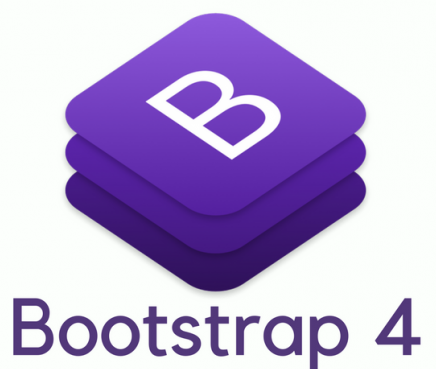
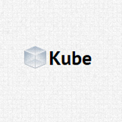
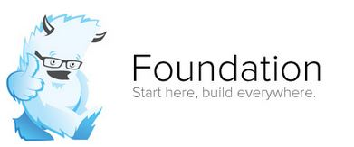
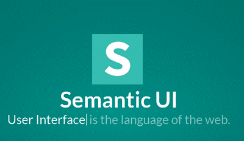
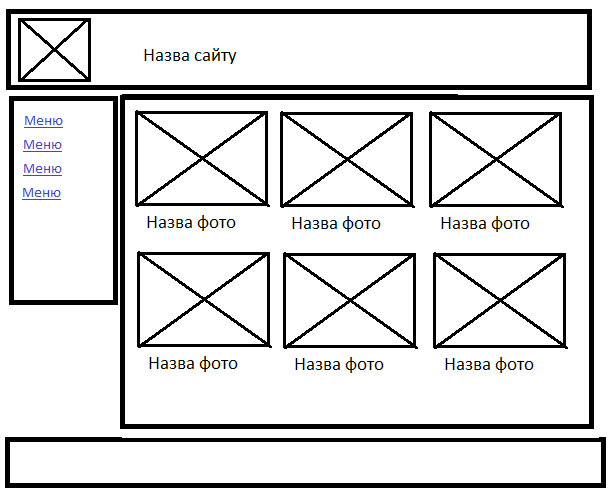
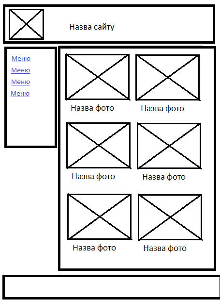
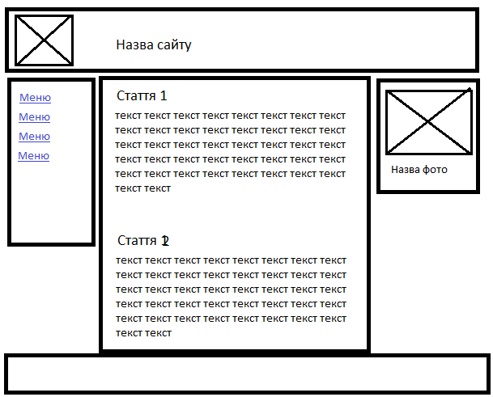

# Створення каркасу адаптивної сторінки за допомогою фреймворку Bootstrap

## Перелік лабораторних робіт

1.  [Створення HTML-сторінки та перевірка її валідатором w3c](lab-01.md)
2.  [Оформлення сторінки з використанням графічних та медіа елементів](lab-01.md)
3.  [Використання методу табличного верстання](lab-01.md)
4.  [Робота з формами та елементами керування. Консоль розробника](lab-01.md)
5.  [Використання методу блочного верстання для створення каркасу документу](lab-01.md)
6.  [Створення адаптивного макету методом блочного верстання](lab-01.md)
7.  [Створення меню до адаптивного макету](lab-01.md)
8.  [Створення каркасу адаптивної сторінки за допомогою фреймворку Bootstrap](lab-01.md)
9.  [Створення адаптивної фотогалереї за допомогою фреймворку Bootstrap](lab-01.md)
10. [Використання коду JavaScript на сторінці. Консоль розробника](lab-01.md)
11. [Створення інтерактивних сторінок за допомогою JavaScript](lab-01.md)
12. [Робота з елементами DOM](lab-01.md)
13. [Оптимізація коду. Використання функцій](lab-01.md)
14. [Створення об'єктів](lab-01.md)
15. [Обробка помилок обчислень](lab-01.md)
16. [Кодування та декодування нотації JSON](lab-01.md)
17. [Створення інтерактивної галереї з використання технології AJAX](lab-01.md)
18. [Використання бібліотеки jQuery для обробки подій на сторінці](lab-01.md)
19. [Використання бібліотеки jQuery для обміну данними](lab-01.md)
20. [Створення фотогалереї за допомогою jQuery та Bootstrap](lab-01.md)

## Мета роботи

Ознайомитись з HTML-CSS фреймворком Bootstrap. Розглянути приклади створення адаптивного каркасу сторінки на базі фреймворку Bootstrap. Навчитись самостійно створювати адаптивні сторінки з використанням Bootstrap. Опанувати створення багаторівневого адаптивного меню.

## Обладнання

Персональний комп'ютер. Текстовий редактор Sublime Text 3 або Notepad++. Пакет програм XAMPP. Web-браузер Chrome, Firefox, Opera, MS Edge

## Теоретичні відомості

### 1. CSS-фреймворк

CSS-фреймворк - фреймворк, створений для спрощення роботи верстальника, швидкості розробки і виключення максимально можливого числа помилок верстки (проблеми сумісності різних версій браузерів і т. Д.). Як і бібліотеки скриптових мов програмування, CSS-бібліотеки, зазвичай мають вигляд зовнішнього css-файлів, що підключаються до проекту (додаються в заголовок веб-сторінки).

Цей CSS файл містить вже написаний за вас набір стилів, які ви зможете застосовувати до елементів на вашому веб-сайті, після того, як ця бібліотека буде підключена до вашої веб-сторінці.

Після того, як файлb фреймворка буде підключено до веб-сторінки, ви можете додавати до ваших елементів не якісь конкретні стилі CSS, а класи, які заздалегіть описані розробниками фреймворка.

### 2. Найуживаніші фреймворки

#### 2.1 Bootstrap

||
|:-----------------------------------------|
| Рис. Логотип Bootstrap 4 |

Має в своєму складі шаблони для відтворення кнопок, сайдбарі, навігаційних панелей, форм та інших елементів сайту. Включає себе JavaScript-розширення.

Основні інструменти bootstrap - шаблони, @media, форми, навігація, АЛЕРТ, типографіка і звичайно ж, сітки. Bootstrap сумісний з усіма основними сучасними браузерами, але в старих версіях браузерів можуть бути проблеми. Підтримує адаптивність. Використовує мови Less і Sass.

#### 2.2 Pure CSS

||
|:--------------------------------------|
| Рис. Логотип Pure CSS |

PureCSS - це набір стилів CSS, розроблених YAHOO. Вони допомагає створювати швидкі, красиві і гнучкі веб-сайти. Даний фреймворк дуже сильно оптимізований та є одиним з найменших фреймворків, всього 3,8 КБ в форматі gzipped.

Pure CSS побудована на Normalize.css, забезпечує компоновку і стиль для власних HTML-елементів, а також для найбільш поширених компонентів для користувача інтерфейсу. А будь-якому CSS-кодеру важливо мати наявність дизайнерського смаку, щоб оперативно додати або поліпшити існуючий елемент і анімацію.

#### 2.3 Kube

||
|:----------------------------------|
| Рис. Логотип Kube |

Надає повну свободу для розробника без нав'язування стилів. Надає максимальну гнучкість оформлення. Має кілька варіантів сітки і позиціонується творцями як фреймворк для професійних CSS-розробників. Використовує Less, підтримує адаптивний дизайн.

#### 2.4 Foundation

||
|:----------------------------------------|
| Рис. Логотип Foundation |

Поряд з іншими основними елементами включає в себе кілька HTML шаблонів з різним розташуванням блоків на сторінці. Має великий набір компонентів на JavaScript. Дуже серйозний за своїми можливостями і складу фреймворк. Використовує Sass. Сумісність коду з усіма основними браузерами.

#### 2.5 Semantic UI

||
|:-----------------------------------------|
| Рис. Логотип Semantic UI |

Містить велику кількість компонентів: іконки, зображення, написи, меню та інші стандартні компоненти. Підтримує останні версії HTML і CSS і має хорошу добірку скриптових модулів і API. Використовує Less. За застосовності змагається з bootstrap. Є варіант російською мовою, але неповний, а організатори проекту пропонують допомогти в перекладі.

### 3. Робота з Bootstrap

#### 3.1 Додавання Bootstrap до проекту

Для початку роботи з Bootstrap необхідно додати його стильовий файл до коду сторінки. Можливе використання Bootstrap в автономному режимі, або в онлайн через посилання на дистрибутив Bootstrap.

Для створення автономної сторінки з елементами Bootstrap необхідно скачати останню версію пакету за посиланням ([5](https://getbootstrap.com)). Далі необхідно розпакувати архів в каталог з вашим проектом та підключити головний стильовий файл **bootstrap.css** або **bootstrap.min.css**.

Для використання онлайн-дистрибутиву Bootstrap необхідно використовуючи інструкцію за посиланням ([6](https://getbootstrap.com/docs/4.4/getting-started/introduction/)) включити в код сторінки головний стильовий файл **bootstrap.css** або **bootstrap.min.css**.

Варто зауважити, що в останньому випадку у раз відсутності Інтернету ваша сторінка буде функціонувати некоректно.

#### 3.2 Структура архіву Bootstrap

Оскільки Bootstrap - комплекс вирішень, що містить у собі стилі, шрифти та виконувані сценарії, то всі файли розбиті на групи і розміщені в різних каталогах. Завантажувальний архів має наступну структуру:

```
bootstrap/
├── css/
│   ├── bootstrap.css
│   ├── bootstrap.min.css
│   ├── bootstrap-theme.css
│   └── bootstrap-theme.min.css
├── js/
│   ├── bootstrap.js
│   └── bootstrap.min.js
└── fonts/
    ├── glyphicons-halflings-regular.eot
    ├── glyphicons-halflings-regular.svg
    ├── glyphicons-halflings-regular.ttf
    └── glyphicons-halflings-regular.woff
```
Файли, що в своєму імені мають суфікс .min є повними аналогами файлів без цього суфіксу, але мають менший розмір, бо з них видалені незначущі пробіли, коментарі та знаки табуляції. Для остаточного (релізного) подання HTML-сторінки бажано використовувати саме min-файли, оскільки вони прискорюють завантаження сторінки.

## Хід роботи

1. Перевірити чи встановлено пакет програм web-розробника XAMPP
2. Викликати панель керування xampp-control.exe
3. Впевнитись, що web-сервер Apache запущений
4. Перейти за адресою http://127.0.0.1/ або http://localhost/ та впевнитись, що сторінка вітання XAMPP завантажилась
5. Очистити зміст каталогу **C:\xampp\htdocs\ **
6. Створити файл **index.html** в середині каталогу **C:\xampp\htdocs\ **
7. У файл **index.html** помістити код порожньої сторінки та підключити фрейимворк Bootstrap
8. Перейти за адресою http://127.0.0.1/ або http://localhost/ та впевнитись, що сторінка, яку ви створили, завантажилася корректно
9. Створіть сторінку фотогалереї, що відповідає прототипу, наведеному нижче. Для розробки каркасу сторінки використати класи Bootstrap.

Оформіть дизайн сторінки згідно з власним смаком. Під час створення імен классів та ідентифікаторів використовувати рекомендації БЕМ. Для виділення окремих структурних блоків сторінки використовувати семантичні елементи HTML5.

||
|:--------------------------------------------------------|
| Рис. Прототип сторінки на великий екран |

||
|:---------------------------------------------------------|
| Рис. Прототип сторінки на середній екран |

||
|:-------------------------------------------------------------|
| Рис. Прототип сторінки на мобільний пристрій |

10. Використовуючи, як приклад, попередній код, створіть триколонковий адаптивний макет, який відповідатиме прототипу. Також необхідно створити варіанти для середнього та малого екранів.

Оформіть дизайн сторінки згідно з власним смаком. Під час створення імен классів та ідентифікаторів використовувати рекомендації БЕМ. Для виділення окремих структурних блоків сторінки використовувати семантичні елементи HTML5.

||
|:-------------------------------------------------------------|
| Рис. Прототип сторінки на великий екран |

11. Модифікувати головне меню сторінок лабораторної роботи №6 таким чином, щоб воно адаптувалося до різних пристроїв за допомогою класів Bootstrap відповідно до наданих макетів.

||
|:-------------------------------------------------------------|
| Рис. Прототип сторінки на великий екран |

||
|:-------------------------------------------------------------|
| Рис. Прототип сторінки на середній екран |

||
|:-------------------------------------------------------------|
| Рис. Прототип сторінки на мобільний пристрій |

12. У "підвал" сторінки помістити інформацію про виконавця роботи: група, ПІБ, дата виконання.
13. Зберегти файли з новим меню та перевірити їх на валідність
14. HTML-код файлу галереї з новим меню та скріншоти на різних екранах зберегти у звіт
15. Зберегти звіт у форматі PDF
16. Роздрукувати звіт та письмово відповісти на контрольні запитання

## Контрольні питання

1. Які CSS-фреймворки ви знаєте? Чим вони між собою відрізняються?
2. Яка особливість файлів із суфіксом .min?
3. Які класи використовуються для створення колонок різної ширини?
4. Яким чином поводять себе колонки рядку, якщо вони не поміщаються в одну лінію?
5. За допомогою яких классів зробити елементи, які невидимі лише на деяких екранах?


## Довідники та додаткові матеріали

1. [Валідатор W3C](https://validator.w3.org)
2. [Довідник HTML та CSS](https://css.in.ua)
3. [Справочник по HTML](http://htmlbook.ru)
4. [Комплексний довідник web-розробника](https://www.w3schools.com)
5. [Bootstrap офіційний сайт](https://getbootstrap.com)
6. [Bootstrap початок роботи](https://getbootstrap.com/docs/4.4/getting-started/introduction/)
