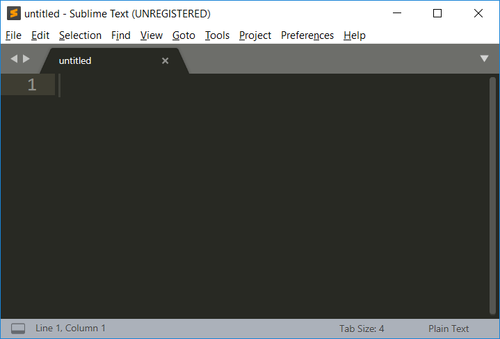
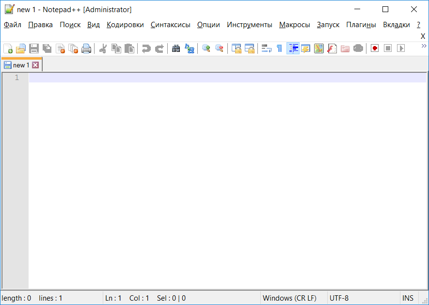
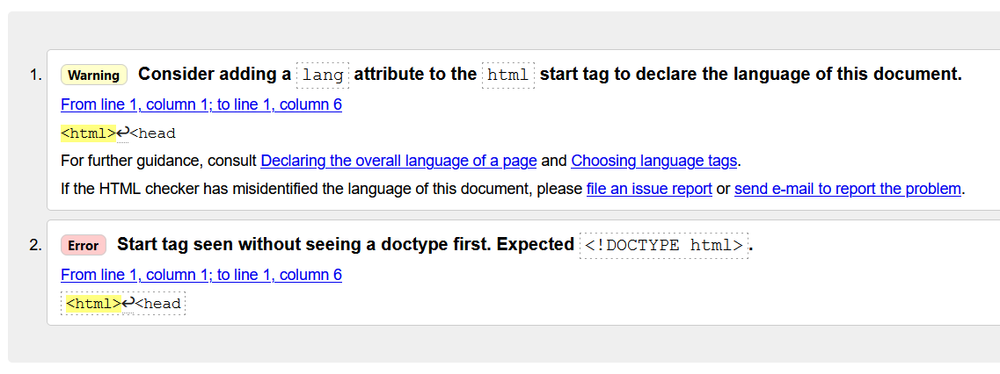

[Перелік усіх робіт](README.md)

# Створення HTML-сторінки та перевірка її валідатором w3c

## Мета роботи

Навчитись користуватись редакторами коду Notepad++ та Sublime Text, створювати прості HTML-сторінки, перевіряти їх валідатором HTML-коду W3C

## Обладнання

Персональний комп'ютер. Текстовий редактор Sublime Text 3 або Notepad++. Пакет програм XAMPP. Web-браузер Chrome, Firefox, Opera, MS Edge

## Теоретичні відомості

## Хід роботи
1.  Відкрити редактор коду та створити новий файл, якщо у вікні редактора вже завантажено будь-який інший
    
    
    
    Вікно редактора Sublime Text 3
    
    
    
    Вікно редактора Sublime Notepad++
    
2.  Зберегти файл з іменем `index.html`
3.  У файл `index.html` помістити наступні рядки:
```html   
<html>
  <head>
    <title>Top page title</title>
  </head>
  <body>
    <h1>Header 1-st level</h1>
    <p> text text text text text text text text </p>
  </body>
</html>
```
    
4.  Перевірити даний файл у валідаторі розмітки W3C за посиланням `https://validator.w3.org/`
5.  Виявити наявність помилок та попереджень. Скорегувати документ відповідно до рекомендацій у посиланнях [4](#link04) та [5](#link05) (тег `<!DOCTYPE html>`, вказати мову документу, кодування документу)
    
    
    
    Документ з помилками
    
    
    
    Документ без помилок
    
6.  Зберегти файл та перевірити його знову
7.  Profit! Ви створили першу валідну HTML-сторінку
8.  Створити короткий опис улюбленого фільму, книги, або комп'ютерної гри
9.  Використати теги заголовків, жирного тексту, абзацу, переліків та гіперпосилань, спираючись на довідники [2](#link02), [3](#link03), [6](#link06) та [7](#link07) - [14](#link14)
10.  Внести зміни у файл `index.html`, зберегти його та перевірити через валідатор
11.  HTML-код файлу та скріншот перевірки валідатором зберегти у звіт
12.  Зберегти звіт у форматі PDF
13.  Роздрукувати звіт та письмово відповісти на контрольні запитання

## Контрольні питання

1.  Що таке HTML?
2.  У чому відмінність HTML та XHTML?
3.  Що таке W3C?
4.  Що знаходиться в секції `<head>`?
5.  Що знаходиться в секції `<body>`?

## Довідники та додаткові матеріали

1.  [Валідатор W3C](https://validator.w3.org/)
2.  [Довідник HTML та CSS](https://css.in.ua/)
3.  [Справочник по HTML](http://htmlbook.ru/)
4.  [Метаданные в HTML](https://developer.mozilla.org/ru/docs/Learn/HTML/%D0%92%D0%B2%D0%B5%D0%B4%D0%B5%D0%BD%D0%B8%D0%B5_%D0%B2_HTML/The_head_metadata_in_HTML)
5.  [Структура документа и веб-сайта](https://developer.mozilla.org/ru/docs/Learn/HTML/%D0%92%D0%B2%D0%B5%D0%B4%D0%B5%D0%BD%D0%B8%D0%B5_%D0%B2_HTML/%D0%A1%D1%82%D1%80%D1%83%D0%BA%D1%82%D1%83%D1%80%D0%B0_%D0%B4%D0%BE%D0%BA%D1%83%D0%BC%D0%B5%D0%BD%D1%82%D0%B0_%D0%B8_%D0%B2%D0%B5%D0%B1-%D1%81%D0%B0%D0%B9%D1%82%D0%B0)
6.  [Комплексний довідник web-розробника](https://www.w3schools.com/)
7.  [Елемент b](https://developer.mozilla.org/ru/docs/Web/HTML/Element/b)
8.  [Елемент strong](https://developer.mozilla.org/ru/docs/Web/HTML/Element/strong)
9.  [Елемент i](https://developer.mozilla.org/ru/docs/Web/HTML/Element/i)
10.  [Елемент h1](https://developer.mozilla.org/ru/docs/Web/HTML/Element/h1)
11.  [Елемент h2](https://developer.mozilla.org/ru/docs/Web/HTML/Element/h2)
12.  [Елемент p](https://developer.mozilla.org/ru/docs/Web/HTML/Element/p)
13.  [Елемент ol](https://developer.mozilla.org/ru/docs/Web/HTML/Element/ol)
14.  [Елемент ul](https://developer.mozilla.org/ru/docs/Web/HTML/Element/ul)
