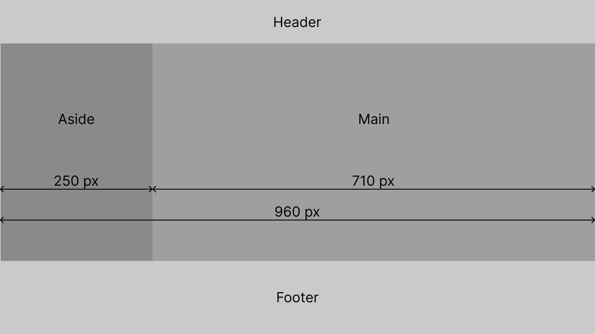
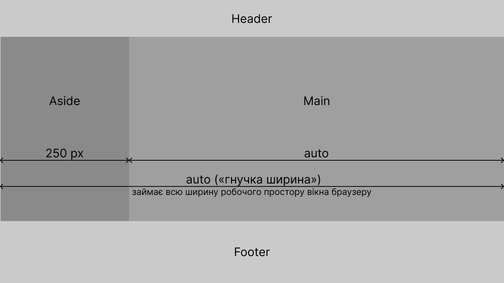
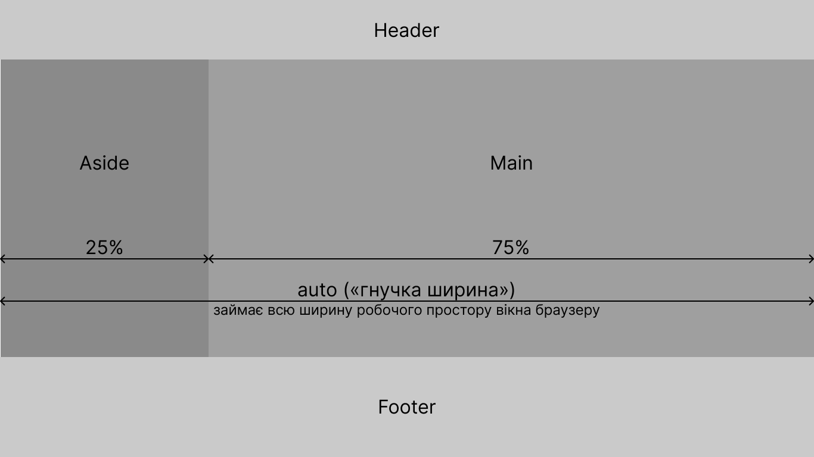
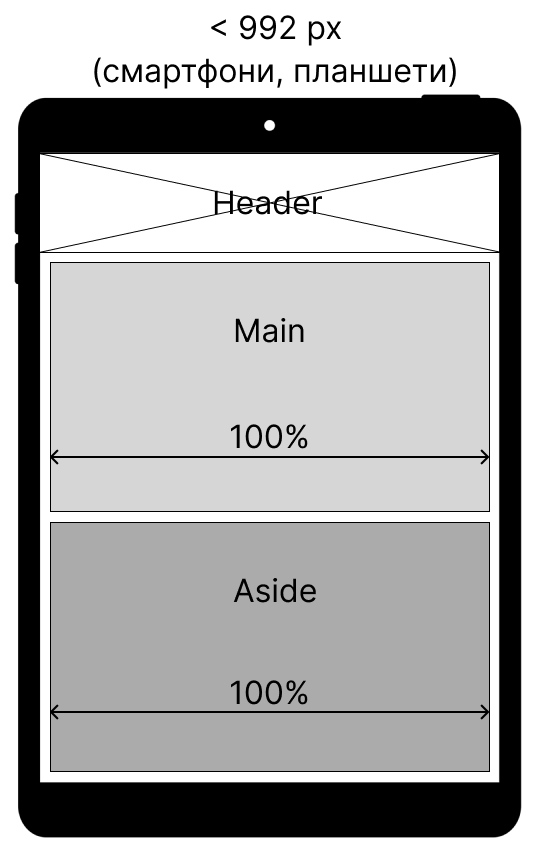
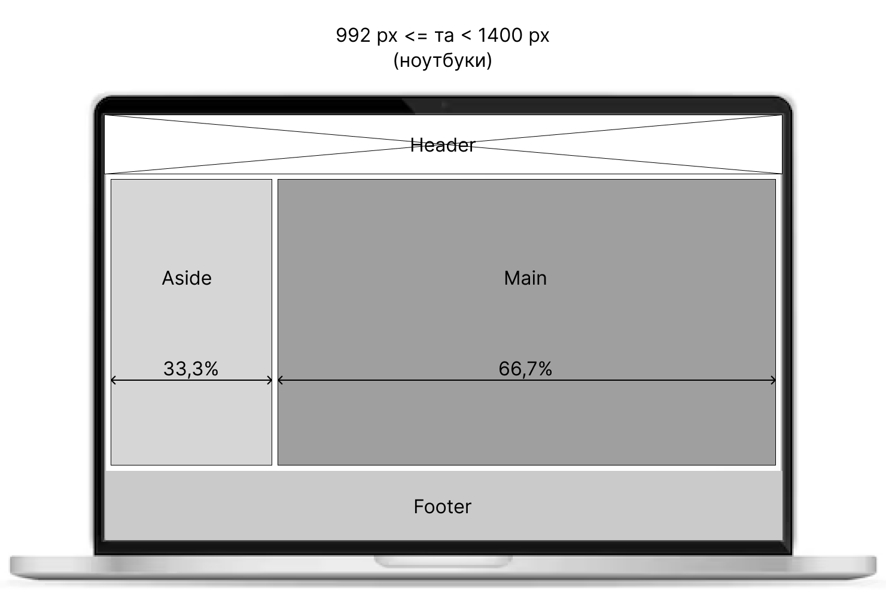
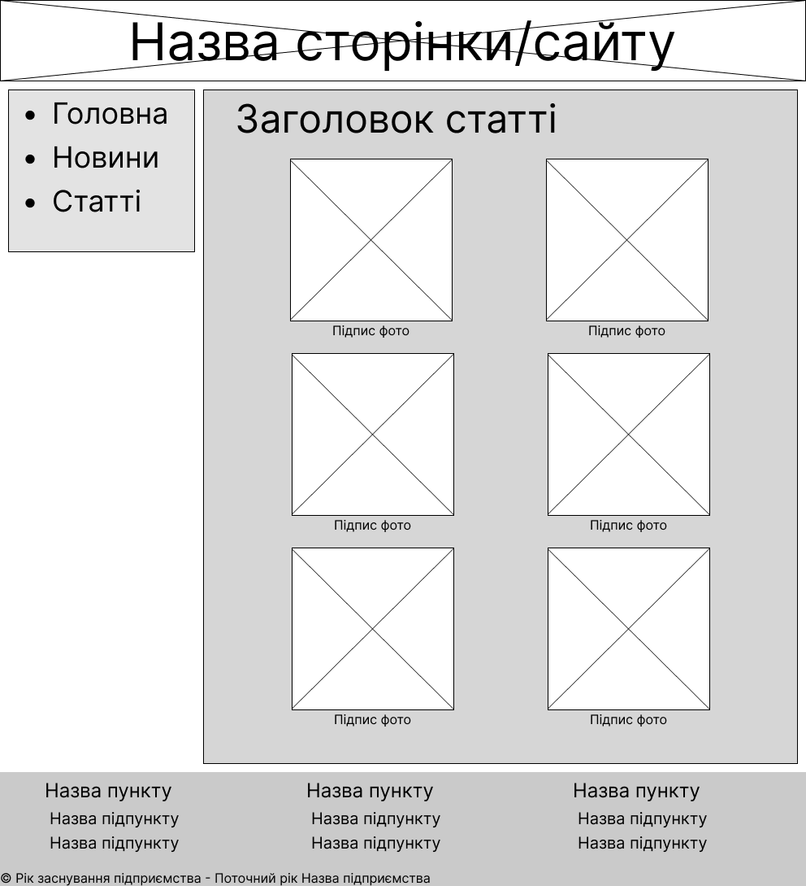

# Створення адаптивного макету методом блочного верстання

[Перелік усіх робіт](../README.md)

## Мета роботи

Розглянути приклади створення адаптивного каркасу сторінки методом блночного верстання. Навчитись створювати адаптивні каркаси за допомогою методики блочного верстання.

## Обладнання

Персональний комп'ютер. Текстовий редактор Sublime Text 3 або Notepad++. Пакет програм XAMPP. Web-браузер Chrome, Firefox, Opera, MS Edge

## Теоретичні відомості

### 1. Відмінності фіксованого, гумового та адаптивного макетів

#### 1.1 Фіксований макет

Фіксований макет сайту - це макет, який має строго фіксовану ширину (в пікселях). Такий вид дизайну широко використовувався для розробки сайтів в минулому. У цей час "панували" комп'ютери з моніторами, що мають діагональ 15" або 17". Ці монітори не сильно відрізнялися за горизонтальною роздільною здатністю. Таким чином, вибравши для розмітки якусь певну ширину, можна розробити сайт, який оптимально б відображався на обмеженній кількості моніторів.

|  |
| :------------------------------------- |
| Рис. Фіксований макет |

HTML та CSS для такого макету може виглядати наступним чином:

```html
<!DOCTYPE html>
<html lang="en">
<head>
	<title>Test page</title>
<style>
body {
  margin: 0;
}
.container {
  margin-left: auto;
  margin-right: auto;
  width: 960px;
}
.aside {
  float: left;
  width: 250px;
}
.main {
  margin-left: 250px;
}
</style>
</head>
<body>
<div class="container">
  <aside class="aside">
    ASIDE
  </aside>
  <main class="main">
    MAIN
  </main>
</div>
</body>
 ```

#### 1.2 Гумовий макет

Гумовий (гнучкий) макет сайту - це макет, який змінюється в залежності від ширини робочої області вікна (вкладки) браузера. Потреба в такій розмітці виникла, коли у користувачів з'явилися монітори, які мають діагональ від 15" до 21" і більше.

Для вирішення проблеми різної роздільної здатності моніторів змінили підходи до створення розмітки, в якій блоки мають не строго фіксовану ширину, а змінну ("гумову", зазвичай задану у відсотках). Такий макет на відміну від фіксованого вже міг «підлаштовуватися» під розміри монітора, тобто змінювати свої розміри.


|  |
|:-----------------------------------------------|
| Рис. Гнучкий макет варіант 1 |

HTML та CSS для такого макету може виглядати наступним чином:
```html
<!DOCTYPE html>
<html lang="en">
<head>
	<title>Test page</title>
<style>
body {
  margin: 0;
}
.aside {
  float: left;
  width: 250px;
}
.main {
  margin-left: 250px;
}
</style>
</head>
<body>
<div class="container">
  <aside class="aside">
    ASIDE
  </aside>
  <main class="main">
    MAIN
  </main>
</div>
</body>
```
|  |
|:-----------------------------------------------|
| Рис. Гнучкий макет варіант 2 |

HTML та CSS для такого макету може виглядати наступним чином:
```html
<!DOCTYPE html>
<html lang="en">
<head>
	<title>Test page</title>
<style>
body {
  margin: 0;
}
.aside {
  float: left;
  width: 25%;
}
.main {
  margin-left: 25%;
}
</style>
</head>
<body>
<div class="container">
  <aside class="aside">
    ASIDE
  </aside>
  <main class="main">
    MAIN
  </main>
</div>
</body>
```

##### 1.3 Адаптивний макет сайту

Адаптивний макет сайту - це макет, який може «пристосовуватися» під різні пристрої (ширину робочої області вікна браузера). Тобто на одних пристроях він може мати одну структуру, а на інших - іншу.

Розглянемо приклад адаптивного макета, що складається з 2 блоків, який на різних пристроях виглядає по-різному. А саме:

1. На смартфонах і планшетах (пристроях з дуже маленьким розміром екрану) блоки повинні розташовуватися вертикально, тобто один під іншим;
2. На ноутбуках (пристроях із середнім розміром екрану) блоки повинні розташовуватися горизонтально (1 блок - 33.3%, 2 блок - 66.7%);
3. На десктопах (пристроях з великим розміром екрану) теж горизонтально, але з іншими розмірами (1 блок - 25%, 2 блок - 75%)

||
||
||
|:-------------------------------------|
| Рис. Адаптивний макет |

HTML та CSS для такого макету може виглядати наступним чином:

```html
<!DOCTYPE html>
<html lang="en">
<head>
	<title>Test page</title>
<style>
body {
  margin: 0;
}
.container {
  display: flex;
  flex-wrap: wrap;
}
.aside, .main {
  width: 100%;
  min-height: 1px;
}
@media (min-width: 992px) {
  .aside {
    flex: 0 0 33.333333%;
    max-width: 33.333333%;
    order: 1;
  }
  .main {
    flex: 0 0 66.666667%;
    max-width: 66.666667%;
    order: 2;
  }
}
@media (min-width: 1400px) {
  .aside {
    flex: 0 0 25%;
    max-width: 25%;
  }
  .main {
    flex: 0 0 75%;
    max-width: 75%;
  }
}
</style>
</head>
<body>
<div class="container">
  <aside class="aside">
    ASIDE
  </aside>
  <main class="main">
    MAIN
  </main>
</div>
</body>
```
## Хід роботи

1. Перевірити чи встановлено пакет програм web-розробника XAMPP
2. Викликати панель керування xampp-control.exe
3. Впевнитись, що web-сервер Apache запущений
4. Перейти за адресою http://127.0.0.1/ або http://localhost/ та впевнитись, що сторінка вітання XAMPP завантажилась
5. Очистити зміст каталогу C:\xampp\htdocs\
6. Створити файл index.html в середині каталогу C:\xampp\htdocs\
7. У файл index.html помістити код, що наданий у теоретичних відомостях в розділі 1.3
8. Перейти за адресою http://127.0.0.1/ або http://localhost/ та впевнитись, що сторінка, яку ви створили, завантажилася корректно
9. Доопрацюйте макети, які були створені у попередній лабораторній роботі так, щоб вони стали адаптивними
10. Створіть сторінку фотогалереї, дизайн якої відповідає макету з попередньої лабораторної та має одну з характеристик, що є у прототипів, які наведені нижче. Такими характеристиками можнуть бути зміна кількості зображень в ряд, головне меню, яке здатне до деформації, тощо.

||
|:--------------------------------------------------------|
| Рис. Прототип сторінки на великий екран |

||
|:---------------------------------------------------------|
| Рис. Прототип сторінки на середній екран |

||
|:-------------------------------------------------------------|
| Рис. Прототип сторінки на мобільний пристрій |

11.  Використовуючи, як приклад, попередній код, створіть триколонковий адаптивний макет, розроблений на основі дизайну з попередніх лабораторних робіт\*\*.

12.  Під час створення імен классів та ідентифікаторів використовувати рекомендації БЕМ. Для виділення окремих структурних блоків сторінки використовувати семантичні елементи HTML5.
13.  Зберегти файли та перевірити їх на валідність
14.  HTML-код файлу галереї та скріншоти на різних екранах зберегти у звіт
15.  Зберегти звіт у форматі PDF
16.  Роздрукувати звіт та письмово відповісти на контрольні запитання


## Контрольні питання

1. Чим відрізняється гнучкий макет від адаптивного?
2. Для чого використовується властивість flex?
3. За допомогою чого можна створити стилі для різних розмірів екрану?
4. Яким чином вказати, що певні стилі будуть відноситись до екрану, розмір якого менше за 1024 пікселі?
5. Чим відрізняються властивості CSS width, min-width, max-width?


## Довідники та додаткові матеріали

1. [Валідатор W3C](https://validator.w3.org)
2. [Довідник HTML та CSS](https://css.in.ua)
3. [Справочник по HTML](http://htmlbook.ru)
4. [Комплексний довідник web-розробника](https://www.w3schools.com)
5. [Семантические элементы HTML5](https://html5book.ru/html5-semantic-elements)
6. [Плавающие элементы](http://htmlbook.ru/samlayout/blochnaya-verstka/plavayushchie-elementy)

---

** - завдання підвищеної складності для самостійного вивчення.
