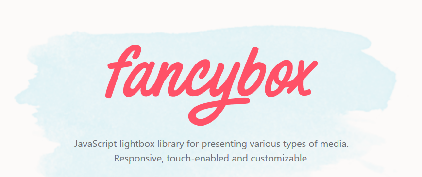
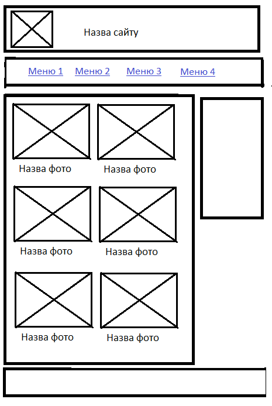
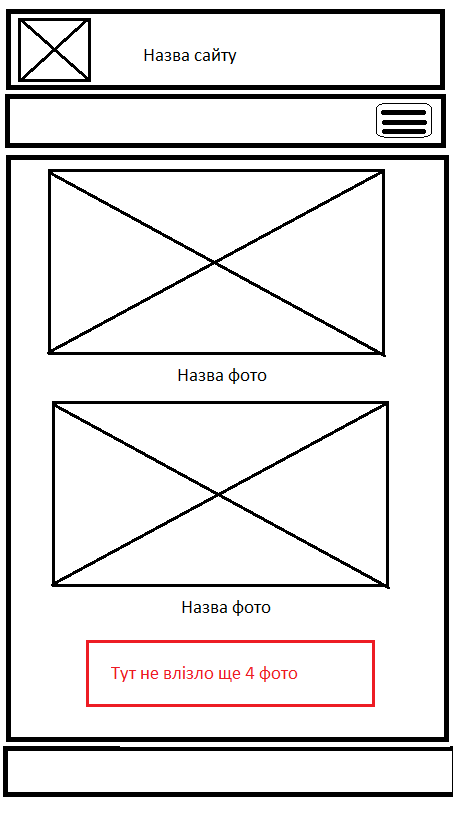
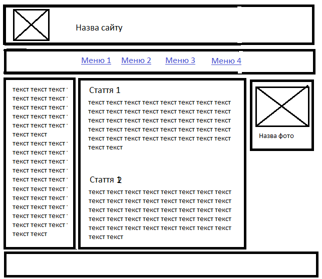

[Перелік усіх робіт](README.md)

# Створення адаптивної фотогалереї за допомогою фреймворку Bootstrap

## Мета роботи

Ознайомитись із додатковими можливостями HTML-CSS фреймворка Bootstrap. Розглянути приклади створення фотогалереї на базі фреймворку Bootstrap та JavaScript-бібліотеки FancyBox та інших до неї подібних. Навчитись самостійно підключати та використовувати додаткові компоненти для створення фотогалерей та інших сторінок з медіа-контентом

## Обладнання

Персональний комп'ютер. Текстовий редактор Sublime Text 3 або Notepad++. Пакет програм XAMPP. Web-браузер Chrome, Firefox, Opera, MS Edge

## Теоретичні відомості

### 1. Бібліотеки для демонстрації зображень у фотогалереях

У фреймворку Bootstrap наразі не існує зручних методів для створення фотогалерей з функціями демонстрації зображень у розгорнутому вигляді. Саме тому для створення таких галерей використовують додаткові бібліотеки, які містять у собі стильові файли та сценарії JS для підтримки інтерактивності галереї.

Оскільки фотогалереї містять інтерактивні елементи, то для їх роботи необхідні сценарії JS. Окрім того, більшість бібліотек являються надбудовами (плагінами) над JS-бібліотекою jQuery, як, власне, і Bootstrap. Для використання бібліотек, що рганізують роботу фотогалерей необхідне буде підключення бібліотеки jQuery. Як підключити jQuery розглянуто в документації до початку роботи із Bootstrap або за посиланням ([4](https://www.w3schools.com)).

### 2. Бібліотека FancyBox



FancyBox - це jQuery-плагін, для створення інтерактивної галереї. Плагін складається з файлів сценаріїв, допоміжних зображень та файлів стилів. Для його корректної роботи необхідне підключення бібліотеки jQuery.

За допомогою цього плагіна можна однаково легко виводити в окремому віконці збільшену картинку при кліці на зменшеному зображенні, організувати галерею слайдів з навігацією і просто вивести попап віконце. Ці три типових завдання показані в нашому

### 3 Робота з FancyBox

Розпочати роботу з FancyBox можна за допомогою підключення CDN-репозиторію. Також можна використати його автономно, у такому випадку необхідно завантажити і розмістити всередині свого проекту усі необхідні файли та під'єднати стильові файли та файли сценаріїв до сторінки. Всі варіанти підключення та використання можна знайти за посиланням ([7](https://fancyapps.com/fancybox/3/)).

Найпростіший варіант використання FancyBox виглядає наступним чином:
```
<!DOCTYPE html>
<html>
 <head>
  <meta charset="utf-8">
  <title>My page</title>

  <!-- CSS -->
  <link rel="stylesheet" type="text/css" href="jquery.fancybox.min.css">
 </head>
 <body>
  <a data-fancybox="gallery" href="big_1.jpg"></a>
  <a data-fancybox="gallery" href="big_2.jpg"></a>

  <!-- JS -->
  <script src="https://code.jquery.com/jquery-3.4.1.min.js"></script>
  <script src="jquery.fancybox.min.js"></script>
 </body>
</html>
```
Файли, що в своєму імені мають суфікс .min є повними аналогами файлів без цього суфіксу, але мають менший розмір, бо з них видалені незначущі пробіли, коментарі та знаки табуляції. Для остаточного (релізного) подання HTML-сторінки бажано використовувати саме min-файли, оскільки вони прискорюють завантаження сторінки.

## Хід роботи

1. Перевірити чи встановлено пакет програм web-розробника XAMPP
2. Викликати панель керування xampp-control.exe
3. Впевнитись, що web-сервер Apache запущений
4. Перейти за адресою http://127.0.0.1/ або http://localhost/ та впевнитись, що сторінка вітання XAMPP завантажилась
5. Очистити зміст каталогу C:\xampp\htdocs\
6. Створити файл index.html в середині каталогу C:\xampp\htdocs\
7. У файл index.html помістити код порожньої сторінки та підключити фрейимворк Bootstrap
8. Перейти за адресою http://127.0.0.1/ або http://localhost/ та впевнитись, що сторінка, яку ви створили, завантажилася корректно
9. Створіть сторінку фотогалереї, що відповідає прототипу, наведеному нижче. Для розробки каркасу сторінки використати класи Bootstrap.

Оформіть дизайн сторінки згідно з власним смаком. Під час створення імен классів та ідентифікаторів використовувати рекомендації БЕМ. Для виділення окремих структурних блоків сторінки використовувати семантичні елементи HTML5.

||
|:-------------------------------------------------------------|
| Рис. Прототип сторінки на великий екран |

||
|:-------------------------------------------------------------|
| Рис. Прототип сторінки на середній екран |

||
|:-------------------------------------------------------------|
| Рис. Прототип сторінки на мобільний пристрій |

10. Використовуючи, як приклад, попередній код, створіть триколонковий адаптивний макет, який відповідатиме прототипу. Також необхідно створити варіанти для середнього та малого екранів.

Оформіть дизайн сторінки згідно з власним смаком. Під час створення імен классів та ідентифікаторів використовувати рекомендації БЕМ. Для виділення окремих структурних блоків сторінки використовувати семантичні елементи HTML5.

||
|:--------------------------------------------------------|
| Рис. Прототип сторінки на великий екран |

11. Модифікувати головне меню сторінок лабораторної роботи №6 таким чином, щоб воно адаптувалося до різних пристроїв за допомогою класів Bootstrap
12. У "підвал" сторінки помістити інформацію про виконавця роботи: група, ПІБ, дата виконання.
13. Зберегти файли з новим меню та перевірити їх на валідність
14. HTML-код файлу галереї з новим меню та скріншоти на різних екранах зберегти у звіт
15. Зберегти звіт у форматі PDF
16. Роздрукувати звіт та письмово відповісти на контрольні запитання


## Контрольні питання

1. Яке призначення бібліотеки FancyBox?
2. Яким чином підключити та використати FancyBox на своїй сторінці?
3. Опишіть переваги та недоліки різних способів підключення FancyBox
4. Для чого FancyBox використовує бібліотеку jQuery?
5. Які альтернативи FancyBox ви знаєте?


## Довідники та додаткові матеріали

1. [Валідатор W3C](https://validator.w3.org)
2. [Довідник HTML та CSS](https://css.in.ua)
3. [Справочник по HTML](http://htmlbook.ru)
4. [Комплексний довідник web-розробника](https://www.w3schools.com)
5. [Bootstrap офіційний сайт](https://getbootstrap.com)
6. [Bootstrap початок роботи](https://getbootstrap.com/docs/4.4/getting-started/introduction/)
7. [FancyBox офіційний сайт](https://fancyapps.com/fancybox/3/)
