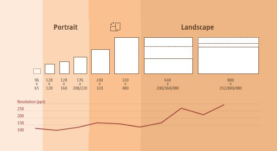
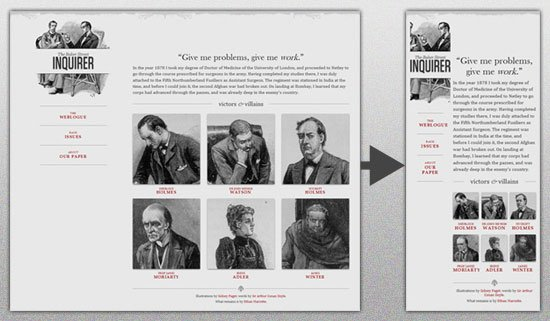
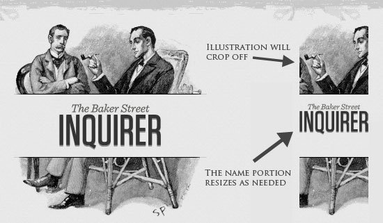
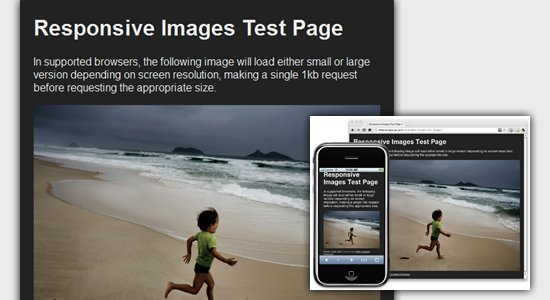
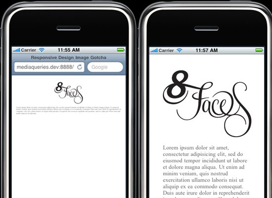
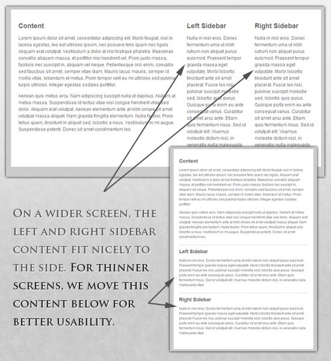
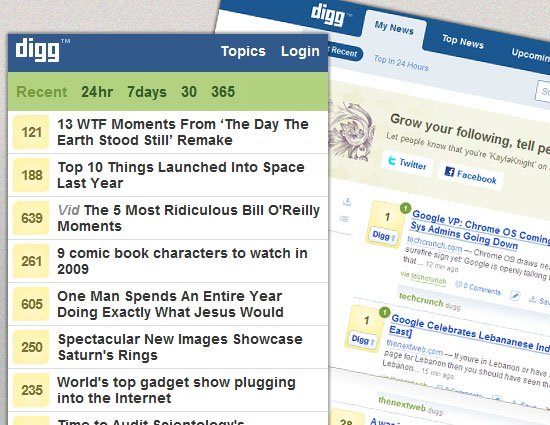
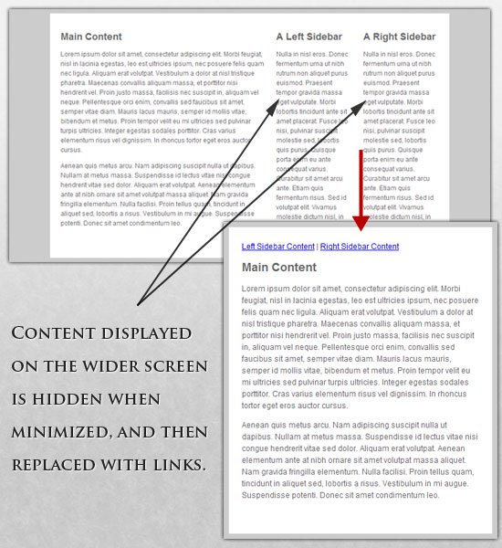

# Основи адаптивної верстки
## Перелік лекцій
1.  [Структура HTML-документа і елементи розмітки заголовка документа](lec-01.md)
2.  [Безпека інформації в мережі Internet](lec-02.md)
3.  [Контейнери тіла документа. Таблиці](lec-03.md)
4.  [Використання стилів CSS для налаштування зовнішнього вигляду документу](lec-04.md)
5.  [Основи блочного верстання документів](lec-05.md)
6.  [Основи адаптивної верстки](lec-06.md)
7.  [Створення інтерфейсів за допомогою фреймворку Bootstrap](lec-07.md)
8.  [Створення мобільних інтерфейсів за допомогою фреймворку Bootstrap ч. 2](lec-08.md)
9.  [Типи даних та перетворення типів](lec-09.md)
10.  [Конструкції мови JavaScript](lec-10.md)
11.  [Створення користувацьких функцій](lec-11.md)
12.  [Об'єкти та методи у мові JavaScript](lec-12.md)
13.  [Об'єктна нотація JSON](lec-13.md)
14.  [Технологія асинхронного обміну даними AJAX](lec-14.md)
15.  [Бібліотека jQuery](lec-15.md)
16.  [Плагіни бібліотеки jQuery](lec-16.md)


## Зміст лекції

1.  [Застосування тегу `<div>`](#h01)
2.  [Гнучкі зображення](#h02)
3.  [Структура макета сторінки, що налаштовується](#h03)
4.  [Опціональне відображення контенту](#h04)
5.  [Теми для самостійного вивчення](#h101)
6.  [Контрольні питання](#h102)

У наші дні практично кожен замовник хоче отримати мобільну версію для свого сайту. І це природно: потрібний один дизайн для iPhone, інший для iPad – і він також повинен підходити під усі інші розміри екранів.

У темі веб-дизайну і розробки ми швидко наближаємося до точки, коли ми будемо не здатні справлятися з нескінченними новими дозволами і екранами. Для багатьох веб-сайтів створення окремої версії для кожного нового дозволу буде неможливим або, принаймні, непрактичним. Чи повинні ми змиритися з втратою відвідувачів, для яких у нас немає верстання? Чи можна щось зробити?

Адаптивне верстання – підхід, що припускає зміну дизайну залежно від поведінки користувача, розміру екрана, платформи і орієнтації девайса. Іншими словами, сторінка повинна автоматично підлаштовуватися під дозвіл, змінювати розмір картинок і так далі. Це дозволить усунути потребу в розробці дизайну для кожного нового пристрою, що з’являється у продажу.

## Регулювання роздільної здатності екрана

Можна розбити пристрої на різні категорії і верстати для кожної з них окремо, але це займе надто багато часу, і хто знає, які стандарти будуть через п’ять років? Тим більше, згідно зі статистикою, що посилається на 400 проданих із 2005 по 2008 рік пристроїв (а зараз 2016), ми маємо цілих спектр різноманітних пристроїв:



Очевидно, що ми не зможемо продовжувати верстати для кожного пристрою окремо. Що ж тоді робити?

#### Часткове рішення: робимо все гнучким

Звичайно, це не ідеальне рішення, але воно розв’язує велику частину проблем.

У статті Ітан Маркотт (Ethan Marcotte) створив [простий шаблон](http://alistapart.com/d/responsive-web-design/ex/ex-site-flexible.html), що демонструє використання гнучкого верстання:



Увесь дизайн – мікс [адаптивних шарів](http://alistapart.com/article/fluidgrids), [картинок](http://unstoppablerobotninja.com/entry/fluid-images) і в деяких місцях розумної розмітки. Створення адаптивних шарів – часта практика, що не можна сказати про адаптивні картинки. Тому нижче представлена техніка для реалізації гнучких картинок:

*   [Hiding and Revealing Portions of Images](http://zomigi.com/blog/hiding-and-revealing-portions-of-images/);
*   [Creating Sliding Composite Images](http://zomigi.com/blog/creating-sliding-composite-images/);
*   [Foreground Images That Scale With the Layout](http://zomigi.com/blog/foreground-images-that-scale-with-the-layout/).

Для детальнішої інформації рекомендуємо ознайомитися з книгою Зої Мклі Гілленуотер (Zoe Mickley Gillenwater) “Flexible Web Design: Creating Liquid Layouts with CSS” і завантажити розділ[“Creating Flexible Images”](http://www.flexiblewebbook.com/bonus.html).

З першого погляду може здатися, що все легко, але це не так. Подивіться на логотип:



Якщо зробити дозвіл занадто маленьким, може здатися, що чіткість картинки знизилась, але це необхідно для того, щоб зберегти пропорції назви. Тому картинка поділена на дві частини: перша частина (ілюстрація) використовується як фон, друга (логотип) змінює свої розміри пропорційно.

Елемент `h1` містить зображення як фон, і картинка вирівняна згідно з фоном контейнера (заголовка).

Гнучкі зображення
-----------------

Одна з найголовніших проблем, яка потребує розв’язання при роботі з адаптивним дизайном, – це робота з картинками. Є багато способів змінювати розмір зображень, і більшість з них реалізується дуже просто. Один з таких прикладів – використання max – width у CSS:
```css
img{
	max-width: 100%;
}
```

**Максимальна ширина** зображення дорівнює 100 % від ширини екрана або вікна браузера, і, коли ширина зменшується, те саме робить і картинка. Зверніть увагу, що `max-width` **не підтримується в IE**, тому використовуйте `width: 100 %`.

Представлений спосіб є відмінним початком у створенні адаптивних зображень, але дозвіл і час завантаження повинні залишатися пріоритетними.

#### Ще один спосіб: чутливі зображення

Техніка, представлена Filament Group, не лише змінює розмір зображень відповідно до пропорцій, але й стискає дозвіл картинок на маленьких екранах, щоб на великих вони не займали додаткового місця.



Для використання цієї техніки потрібно декілька файлів, усі вони доступні на [Github](https://github.com/filamentgroup/Responsive-Images). Спочатку беремо JavaScript- файл (`rwd – images.js`), файл `.htaccess` і `rwd.gif` (файл зображення). Потім використовуємо трохи HTML, щоб зв’язати великі і маленькі дозволи: спочатку маленьке зображення з префіксом `.r` (для позначення того, що картинка має бути адаптивною) потім відсилання до більшого зображення, використовуючи `data-fullsrc.` Для будь-якого екрана ширше 480 пікселів завантажиться зображення з великим дозволом (`largeRes.jpg`); маленьким екранам не знадобиться завантажувати велике зображення, завантажиться маленьке (`smallRes.jpg`).

#### Цікава фіча для iPhone

Є одна цікава річ, iPhone, що стосується й iPod. Дизайн, створений для великих екранів, просто стиснеться для маленького браузера, без необхідності додавання скрола або додаткового мобільного верстання. Проте зображень і тексту не буде видно:



Для розв’язання цієї проблеми скористаємося тегом `meta`: якщо `initial-scale` дорівнює одиниці, ширина картинок буде дорівнювати ширині екрана.

## Структура макета сторінки, що налаштовується

Для надзвичайних змін розмірів ми можемо захотіти змінити розташування елементів у цілому через окремий файл зі стилями або, що ефективніше, через CSS-медіазапит. Це не повинно викликати особливо багато проблем, оскільки більшість стилів залишаться колишніми, але деякі зміняться.

Наприклад, у нас є головний файл зі стилями, який задає `#wrapper`, `#content`, `#sidebar`, `#nav` разом з кольорами, фоном і шрифтами. Якщо наші головні стилі роблять макет занадто вузьким, коротким, широким або високим, ми можемо це визначити і підключити нові стилі.

style.css (основний):
```css
\* Default styles that will carry to the child style sheet */
html, body{ 
	background... font... color...
}

h1, h2, h2{
}
p, blockquote, pre, code, ol, ul{
}

/\* Structural elements \*/
#wrapper{ 
	width: 80%; 
	margin: 0 auto; 
	background: #fff; 
	padding: 20px;
}

#content{ 
	width: 54%; 
	float: left; 
	margin-right: 3%;

}

#sidebar-left{ 
	width: 20%; 
	float: left; 
	margin-right: 3%;

}

#sidebar-right{ 
	width: 20%; 
	float: left;

}
```


`mobile.css (дочірній) :`

```css
    #wrapper{
    width: 90%;
    }
    #content{
    	width: 100%;
    }
    
    #sidebar - left{ 
    	width: 100%; clear: both;
    	/* Additional styling for our new layout */ 
    	border-top: 1px solid #ccc;
    	margin-top: 20px;
    }
    
    #sidebar - right{ width: 100%; clear: both;
    	/* Additional styling for our new layout */
    	border-top: 1px solid #ccc; 
    
    }
```



#### Медіазапити CSS3

Давайте подивимося, як можна використати CSS3- медіазапити для створення адаптивного дизайну. `min-width` задає мінімальну ширину вікна браузера або екрана, до якої будуть застосовані певні стилі. Якщо значення буде нижче `min-width`, то стилі будуть проігноровані; `max-width` робить протилежне.

Приклад:
```css
@media screen and (min-width: 600px){ 
	.hereIsMyClass {
 width: 30%; float: right; 
	}

}
```
Медіазапит запрацює тільки у тому випадку, коли `min-width` буде більше або дорівнюватиме 600 px.
```css
@media screen and (max -width: 600px){ .aClassforSmallScreens {
 clear: both; font-size: 1.3em; 
	}

}
```
У цьому випадку клас (`aClassforSmallscreens`) спрацює, коли ширина екрана буде менше або дорівнюватиме 600 px.

Тоді як `min-width` і `max-width` можуть бути застосовані до екранів і вікон браузерів, нам може знадобитися працювати тільки з шириною пристрою. Для цього можна використати `min-device-width` і `max-device-width`:
```css
@media screen and (max-device-width: 480px){ .classForiPhoneDisplay {
 font-size: 1.2em; 
	}

}
```
```css
@media screen and (min-device-width: 768px) { .minimumiPadWidth {
 clear: both; margin-bottom: 2px solid #ccc; 
	}

}
```
Спеціально для iPad у медіазапитів є властивість `orientation`, значеннями якого можуть бути або `landscape` (горизонтальний) або `potrait` (вертикальний):
```css
@media screen and (orientation: landscape) { .iPadLandscape {
 width: 30%; float: right; 
	}

}
```
```css
@media screen and (orientation: portrait) { .iPadPortrait {
 clear: both; 
	}

}
```
Також значення медіазапитів можна комбінувати, наприклад:
```css
@media screen and (min -width: 800px) and (max -width: 1200px) { .classForaMediumScreen {
 background: #cc0000; width: 30%; float: right; 
	}

}
```
Цей код буде виконаний тільки для екранів або вікон браузерів шириною між 800 і 1200 px.

#### JavaScript

Якщо Ваш браузер не підтримує CSS3-медіазапити, то заміну стилів можна організувати за допомогою jQuery.

## Опціональне відображення контенту


Можливість стискати і міняти місцями елементи, так,щоб вони всі вміщалися на маленьких екранах, це чудово. Але це не кращий варіант. Для мобільних пристроїв зазвичай використовуються: спрощена навігація, більше сфокусований контент, списки або рядки замість колонок.



На щастя, CSS дає нам можливість показувати і ховати контент з неймовірною легкістю!

>display: none;

`display: none` використовується для об’єктів, які треба сховати.

Приклад:



У головному файлі стилів ми міняємо посилання на колонки, оскільки у нас великий екран, щоб відобразити весь контент.

`style.css (основний) :`
```css
#content{ 
	width: 54%; 
	float: left; 
	margin-right: 3%;
}

#sidebar - left{ 
	width: 20%; 
	float: left; 
	margin-right: 3%;
}

#sidebar - right{ 
	width: 20%; 
	float: left;
}

.sidebar - nav{ 
	display: none;
}
```


Тепер ховаємо колонки і показуємо посилання:

`mobile.css (спрощений) :`
```css
#content{ 
	width: 100%;
}

#sidebar - left{ 
	display: none;
}

#sidebar - right{ 
	display: none;
}

.sidebar - nav{ 
	display: inline;
}
```


З можливостями ховати і показувати елементи, змінювати розміри картинок, елементів і багато іншого, дизайн зміг пристосовуватися до різних пристроїв та екранів. Якщо розмір екрана зменшується, можна, наприклад, використати скрипт або альтернативний файл зі стилями, щоб збільшити білий простір, або замінити навігацію для більшої зручності.

## Теми для самостійного вивчення

1.  Плаваючі об'єкти. Обтікання текстом

## Контрольні запитання

1.  Що таке адаптивне верстання?
2.  Що таке чутливі зображення?
3.  Яким чином можна змінювати розмір зображень?
4.  Які є типм медіазапитів?
5.  За допомогою чого можна працювати тільки з шириною пристрою?