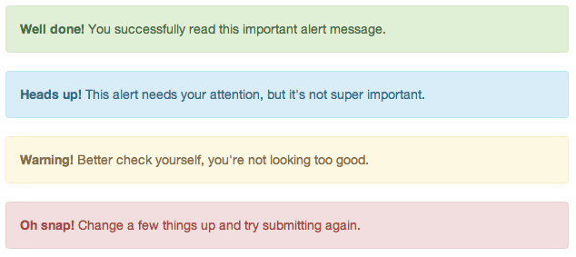
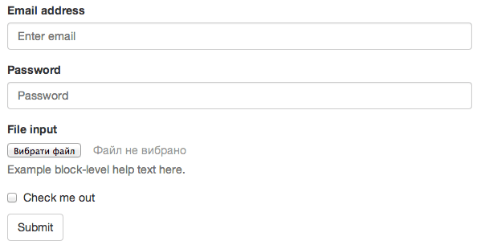
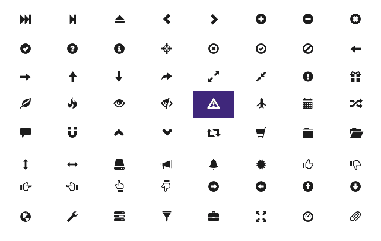
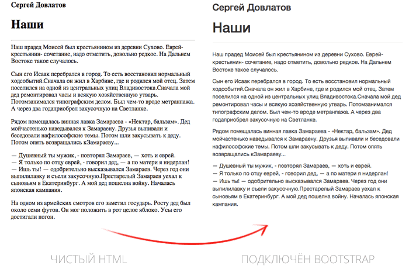
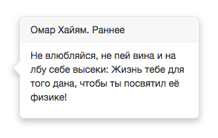
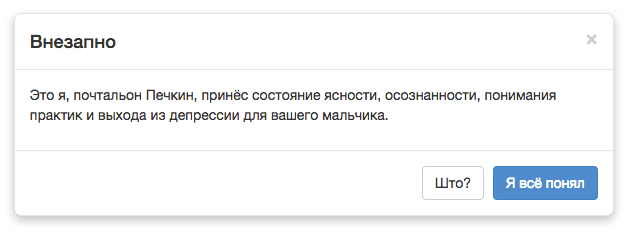

# Структура HTML-документа і елементи розмітки заголовка документа
## Перелік лекцій
1.  [Структура HTML-документа і елементи розмітки заголовка документа](lec-01.md)
2.  [Безпека інформації в мережі Internet](lec-02.md)
3.  [Контейнери тіла документа. Таблиці](lec-03.md)
4.  [Використання стилів CSS для налаштування зовнішнього вигляду документу](lec-04.md)
5.  [Основи блочного верстання документів](lec-05.md)
6.  [Основи адаптивної верстки](lec-06.md)
7.  [Створення інтерфейсів за допомогою фреймворку Bootstrap](lec-07.md)
8.  [Створення мобільних інтерфейсів за допомогою фреймворку Bootstrap ч. 2](lec-08.md)
9.  [Типи даних та перетворення типів](lec-09.md)
10.  [Конструкції мови JavaScript](lec-10.md)
11.  [Створення користувацьких функцій](lec-11.md)
12.  [Об'єкти та методи у мові JavaScript](lec-12.md)
13.  [Об'єктна нотація JSON](lec-13.md)
14.  [Технологія асинхронного обміну даними AJAX](lec-14.md)
15.  [Бібліотека jQuery](lec-15.md)
16.  [Плагіни бібліотеки jQuery](lec-16.md)
МЗКІТ. Лекція №7  

МЗКІТ. Лекція №7

*   [Зміст](index.html)
*   [01](lec-01.html)
*   [02](lec-02.html)
*   [03](lec-03.html)
*   [04](lec-04.html)
*   [05](lec-05.html)
*   [06](lec-06.html)
*   [07](lec-07.html)
*   [08](lec-08.html)
*   [09](lec-09.html)
*   [10](lec-10.html)
*   [11](lec-11.html)
*   [12](lec-12.html)
*   [13](lec-13.html)
*   [14](lec-14.html)
*   [15](lec-15.html)
*   [16](lec-16.html)

Створення інтерфейсів за допомогою фреймворку Bootstrap
=======================================================

1.  [Склад фреймворка](#h01)
2.  [Колонкова система](#h02)
3.  [Типографіка](#h03)
4.  [Сповіщення (alerts)](#h04)
5.  [Навігація](#h05)
6.  [Форми](#h06)
7.  [Іконочний шрифт](#h07)
8.  [Як підключити](#h08)
9.  [Стилі для текстів (Typography)](#h09)
10.  [Блочна система (Grid system)](#h010)
11.  [Таблиці (Tables)](#h011)
12.  [Кнопки (Buttons)](#h012)
13.  [Чуйні елементи (Responsive utilities)](#h013)
14.  [Компоненти (Components)](#h014)
15.  [JavaScript компоненти](#h015)
16.  [Теми для самостійного вивчення](#h016)
17.  [Контрольні запитання](#h017)

Склад фреймворка
----------------

**Bootstrap** — це CSS/HTML-фреймворк для створення сайтів. Іншими словами, це набір інструментів для верстки. У ньому є ряд переваг, завдяки яким BS вважається найпопулярнішим серед собі подібних. Переваги бутстрапа:

1.  _Швидкість роботи_ — завдяки безлічі готових елементів верстка з бутстрапа займає значно менше часу;
2.  _Масштабованість_ — додавання нових елементів не порушує загальну структуру документів;
3.  _Легко налаштовувати_ — редагування стилів проводиться шляхом створення нових css-правил, які виконуються замість стандартних. При цьому не потрібно використовувати атрибути типу “! important”;
4.  _Велика кількість шаблонів_ — про шаблони Bootstrap я напишу далі;
5.  _Величезне співтовариство розробників_;
6.  _Широка сфера застосування_ — Bootstrap використовується в створенні тем для практично будь-яких CMS (OpenCart, Prestashop, Magento, Joomla, Bitrix, WordPress і будь-які інші), в тому числі для односторінкових додатків.  
    Особливою популярністю користується Bootstrap для створення однострорінкових або лендингів (landing page).

Потрібно зауважити, що бутстрап — це скоріше набір з трьох фреймворків: css/html, js-компонентів і **іконочного шрифту**.

Колонкова система
-----------------

Блокова система в Bootstrap — основа грамотної верстки, потужний інструмент для блочного каркасу блоків контенту і будь-яких вкладених елементів. За допомогою префіксів ми можемо вказувати, як потрібно міняти відображення блоків в залежності від типу пристрою, на якому відображається сайт.

Наприклад, клас `.col-xs-` буде використано для телефонів з шириною екрану менше 768 пікселів, а `.col-lg-` — для будь-яких пристроїв з екраном ширше 1170 px. BS розбиває ширину батьківського блоку на 12 рівних частин, які ми можемо використовувати як завгодно. Частини можна об’єднувати, отримуючи, наприклад, три колонки: дві по 25% `.col-lg-3` і одну на 50% `.col-lg-6`.

Візуально колонки можуть бути сформовані у будь-якій комбінації:


Якщо ви вийдете за межі 12 частин, блоки будуть відображатися один під одним, тому стежте за ними. Ось приклад блоків, які будуть відображатися однаково на всіх пристроях. Ми розділимо екран на три рівні частини:

    <div class="row">
    			<div class="col-sm-4">Перва колонка</div>
    			<div class="col-sm-4">Друга колонка</div>
    			<div class="col-sm-4">Третя колонка</div>
    		</div>

Типографіка
-----------

Крім оформлення блоків і структури сторінки, Bootstrap дозволяє оформити текст: абзаци, цитати, заголовки, підзаголовки, різні розміри тексту, вставки коду тощо У більшості випадків вам не доведеться міняти встановлені за умовчанням параметри тексту, адже все відступи, заголовки, відстані між рядками та інше прописані з точністю як в аптеці.

Чимало уваги приділено і семантиці: основний заголовок можна оформити тегом `<h1>Заголовок</h1>`, а можна і `<div class="h1">Заголовок</div>` — виглядати обидва варіанти будуть однаково, зате другий можна використовувати скільки завгодно разів на сторінці.

Якщо ви хочете спробувати верстати на бутстрапі, але не хочете копатися в чомусь складному, почніть з малого: оформіть текстову сторінку з будь-якої новиною. Розмежуйте заголовок, другорядні заголовки, вставте зображення, кілька цитат, списків і оцініть, як легко цей фреймворк впорається з такими завданнями.

Сповіщення (alerts)
-------------------

Будь-яке cповіщення можна оформити в 4-х стандартних форматах: успіх (success), підказка (info), попередження (warning), помилка (danger). Так вони виглядають в житті:



Для оформлення такого повідомлення досить додати два атрибута класу до потрібного об’єкту:

    <div class="alert alert-success" role="alert">Ви успішно дочитали до цього місця</div>
    			<div class="alert alert-info" role="alert">Це ще не кінець статті</div>
    			<div class="alert alert-warning" role="alert">Читати мало, потрібно все застосовувати на практиці</div>
    		<div class="alert alert-danger" role="alert">Так, це не смішно</div>

Навігація
---------

Навігація — вічна проблема, на якій зазвичай буксує верстка. Грамотно заверстані, оформлені елементи навігації — це одне з найскладніших завдань верстки. У Bootstrap їй приділено окрему увагу: фреймворк має оформлення для табів, посторінкової навігації, вкладок, бокового меню, «хлібних крихт» (breadcrumbs), головного меню, тулбару тощо.

Головне меню легко оформляється в такий вигляд:


> Щоб зафіксувати головне меню, досить буде додати клас `navbar-fixed`.

Посторінкова навігація виглядає так:


Код для неї буде потрібно такий:

    <ul class="pagination">
    			<li><a href="#">&laquo;</a></li>
    			<li><a href="#">1</a></li>
    			<li><a href="#">2</a></li>
    			<li><a href="#">3</a></li>
    			<li><a href="#">4</a></li>
    			<li><a href="#">5</a></li>
    			<li><a href="#">&raquo;</a></li>
    		</ul>

Як бачите, нічого складного.

Форми
-----

Текстові поля і блоки (textarea), кнопки, лейбли, радіокнопки, чекбокси, випадні списки — для всіх елементів форм у бутстрапа є стилі оформлення. Можна оформити вертикальне та горизонтальне розташування елементів і назв, а також підсвічувати частини форми при виникненні помилок або попереджень.



Можна оформити горизонтальне розташування блоків, все поля в один рядок і …

Кнопки
------

Тут все просто, щоб оформити кнопку, їй додається потрібний набір класів. Кнопки можуть бути різними:


Код для них такий:

    <button type="button" class="btn btn-default">Кнопка</button>
    			<button type="button" class="btn btn-primary">Основна</button>
    			<button type="button" class="btn btn-success">Успіх</button>
    			<button type="button" class="btn btn-info">Інформація</button>
    			<button type="button" class="btn btn-warning">Увага</button>
    			<button type="button" class="btn btn-danger">Помилка</button>
    		<button type="button" class="btn btn-link">Посилання</button>

Таблиці
-------

Старі добрі таблиці оформляються шляхом додавання класу `class="table"`. Отримаємо красиво оформлену таблицю:


JS-компоненти
-------------

*   Випадні списки,
*   Згортання блоків,
*   Модальні вікна

Крім стилів оформлення у бутстрапа є сценарії поведінки для модальних вікон, слайдера, сплиних підказок, табів та інших інтерактивних елементів сторінки.

Для роботи цих компонентів потрібна jquery, не забудьте переконатися, що вона підключена до `bootstrap.js`.

Іконочний шрифт
---------------

Іконочний шрифт дозволить вам відмовитися від надокучливих спрайтів для іконок і значно спростити собі життя. Єдине обмеження, яке накладає таку спосіб — кожній копії іконки можна призначити тільки один колір.



Як підключити
-------------

Заходьте на [офсайт](../../https@getbootstrap.com/customize/default.htm) і виберіть ті елементи, які вам будуть потрібні в роботі. Зайве можна прибирати і додавати за мірою необхідності. Після вибору тиснемо «Compile and Download», отримуємо архів, який розпаковуємо.


Для базової роботи буде потрібно тільки один файл, він відзначений червоним. Переносите його в папку з вашими css і підключаєте в `<head>` сторінок.

    <link rel='stylesheet' href='/css/bootstrap.min.css' type='text/css' media='all'>

Іконочний шрифт знаходиться в папці _fonts_ і якщо він потрібен, стежте за тим, щоб він в ній і залишався. Дотримуйтесь структуру папок, щоб все працювало як задумано.

Базові стилі Bootstrap (Common CSS)
-----------------------------------

Це набір основних елементів, які потрібні для базової верстки. Їх я б рекомендував завжди залишати зазначеними.

Стилі для друку (Print media styles)
------------------------------------

Це стилі, які буде використовувати браузер при підготовці сторінки до друку. Налаштувати їх на свій розсуд ви можете в окремих стилях в такому форматі:

    @media print {
    				/* ваші стилі */
    			}

Стилі для текстів (Typography)
------------------------------

Базове оформлення тексту: відступи, абзаци, цитати, виділення коду, відформатованого тексту, заголовки, під-і надрядковий текст – все це буде оформлено цим набором стилів.

Навіть якщо ви не будете використовувати класи на сторінці, її вміст буде оформлено в bootstrap-стилі . Це зручно для тих випадків, коли ви не можете або не хочете копатися в старому коді. Досить підключити бібліотеку, щоб текст став більш читабельним.

Ось як зміниться звичайний текст без будь-яких додаткових стилів:



Оформлення коду (Code)
----------------------

Оформлення коду на сторінках. Звичайно, тут немає підсвічування синтаксису, для цього доведеться користуватися окремим плагіном (ніяк, до речі, не пов’язаним з бутстрапа), але відрізнити код від звичайного тексту можна буде, уклавши його в тегах `<code>`, `<pre>` або `<kdb>`.

Блочна система (Grid system)
----------------------------

Магія будь-якого css-фреймворка досі призводить до розчулення старців, які верстали років 10 назад і перед початком верстки думали, верстати таблицями або блоками. Простим додаванням потрібних класів ви отримуєте адаптивну (responsive) верстку для вашого сайту за 10 хвилин.

Зараз же покажу вам приклад того, яким це може бути на вигляд:


Таблиці (Tables)
----------------

Таблична верстка давно залишилася в минулому, але табличні дані повинні відображатися відповідно, якщо не зазначено інше. Без належного оформлення таблиці виглядають вкрай непривабливо.

Намагайтеся уникати такого:


Після простого додавання Bootstrap без змін в html таблиця стане такою:


Форми (Forms)
-------------

Якщо вам потрібно оформляти форми, Bootstrap вміє і це:


Відмічайте цей елемент, якщо вам доведеться оформляти форми.

Кнопки (Buttons)
----------------

Кнопки в Bootstrap — це тема для окремої розмови: за замовчуванням є 4 розміру і 7 видів кнопок. Крім того, є кнопки з випадним меню, блоки з кнопок тощо. Повторюючи матеріал першого уроку, нагадаю, що кнопки за замовчуванням такі:


Чуйні елементи (Responsive utilities)
-------------------------------------

У Bootstrap є набір зручних інструментів для швидкої і зручної верстки під мобільні пристрої. Завдяки їм можна ховати і відображати ті чи інші компоненти на різних пристроях і міняти їх розміри окремо для великих, дрібних і середніх розмірів екрану.

«Чуйні компоненти» дозволять істотно заощадити код і складаються з таких компонентів (для версії Bootstrap 3):

| |Дуже дрібні екрани Телефони (до 768 px)|Маленькі екрани Планшети (≥768px)|Середні екрани Настольні (≥992px)|Великі екрани Настольні (≥1200px)|
| -- | -- | -- | -- | -- |
|.visible-xs-*| Видимий| Прихований| Скрытый| Прихований|
|.visible-sm-*| Прихований| Видимий| Прихований| Прихований|
|.visible-md-*| Прихований| Прихований| Видимий| Прихований|
|.visible-lg-*| Прихований| Прихований| Прихований| Видимий|
|.hidden-xs| Прихований| Видимий| Видимий| Видимий|
|.hidden-sm| Видимий| Прихований| Видимий| Видимий|
|.hidden-md| Видимий| Видимий| Прихований| Видимий|
|.hidden-lg| Видимий| Видимий| Видимий| Прихований|


Як бачите, один і той же блок можна заховати на планшеті і показувати тільки на робочому столі і мобільному.

Компоненти (Components)
-----------------------

Тут розповім коротко, так як ці компоненти невеликі і з назви легко зрозуміти їх призначення.

1.  **Glyphicons**: **іконочний шрифт**. Важить близько 250 кб і використовується нечасто. Тому якщо не потрібен — відключайте.
2.  **Button groups**: блоки, які об’єднують кілька кнопок.
3.  **Input groups**: розширення для текстових блоків і полів, наприклад, так: 
4.  **Navs, таби, вкладки**: навигація з табами, вимагає підключення js-модуля.
5.  **Navbar**: навігація головного меню; може бути закріпленим, світлим або темним.
6.  **Breadcrumbs**: хлібні крихти  
    
7.  **Pagination**: посторінкова навігація; особливо корисна для блогів.
8.  **Pager**: кнопки “вперед” і “назад”.
9.  **Labels**: 6 видов “наклейок”: 
10.  **Badges**: виноски. Наприклад, для позначення непрочитаних листів.
11.  **Jumbotron**: великий блок з текстовим привітанням. Зазвичай використовується на промо-сайтах для короткого опису проекту.
12.  **Thumbnails**: оформлення зменшених копій фотографій.
13.  **Alerts**: повідомлення (успіх, помилка, інформація, підказка).
14.  **Progress bars**: прогрес, вказується в процентах, можна додати анімацію й смугастий фон.
15.  **Media items**: оформлення блоків з коментарями, твітами тощо. Це зазвичай списки з елементами вкладеності, яка відрізняється відступом з лівого краю. Як у звичайних деревовидних коментарів.
16.  **List groups**: оформлення списків з додатковими можливостями: виноски, список з посилань, повідомлення (дивіться “labels”)
17.  **Panels**: блоки з заголовком, основним контентом і футером. Можуть використовуватися як для розширених повідомлень, так і для елементів управління або форм.
18.  **Responsive embed**: “чуйні” об’єкти вміють розтягуватися на різних розмірах екрану, щоб відображати відео в правильному співвідношенні сторін і без явного вказівки розмірів.
```html
<!-- відео зі співвідношенням сторін 16:9 -->
	<div class="embed-responsive embed-responsive-16by9">
	<iframe class="embed-responsive-item" src="…"></iframe>
	</div>
<!-- відео зі співвідношенням сторін 4:3 -->
	<div class="embed-responsive embed-responsive-4by3">
	<iframe class="embed-responsive-item" src="…"></iframe>
	</div>		
```

    
19.  **Wells**: вставки з підказками, альтернативне оформлення цитат і так далі.
20.  **Close icon**: думаю, тут все ясно.

JavaScript компоненти
---------------------

Bootstrap розширює функціонал динамічними функціями. Ця частина фреймворка працює на основі jQuery і вимагає, щоб він був підключений до `bootstrap.min.js`. Складається з таких компонентів:

1.  **Component animations** (for JS): плавні переходи, анімація.
2.  **Collapse**: згортання блоків, спойлери
3.  **Dropdowns**: випадають списки.
4.  **Tooltips**: невеликі підказки. 
5.  **Popovers**: спливаючі підказки, в яких можна додавати динамічний контент, заголовок і основний текст: 
6.  **Modals**: спливні вікна. Можна міняти розміри, додавати заголовок, основний текст і футер. І модифікувати як завгодно. На вигляд за замовчуванням таке: 
7.  **Carousel**: простий [слайдер](../../https@getbootstrap.com/examples/carousel/default.htm) з декількома варіантами руху.
8.  Tabs.js,створення вкладок і табів

Налаштування змінних
--------------------

Ви можете модифікувати стандартні параметри як завгодно. Можна створити свою тему Bootstrap двома способами:

1.  створити свій style.css і в ньому вказувати стилі, які “перекриють” стандартні;
2.  в блоці Less Variables поміняти параметри на потрібні і завантажити архів з бутстрапа, налаштованим тільки для вас.

Теми для самостійного вивчення
------------------------------

1.  Плаваючі об'єкти. Обтікання текстом

Контрольні запитання
--------------------

1.  Що таке адаптивне верстання?
2.  Що таке чутливі зображення?
3.  Яким чином можна змінювати розмір зображень?
4.  Які є типм медіазапитів?
5.  За допомогою чого можна працювати тільки з шириною пристрою?